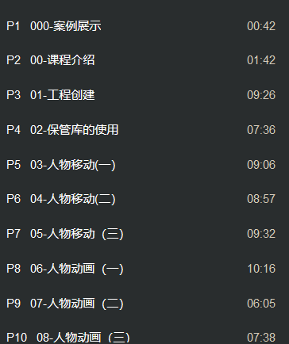

p1~p10

actor 游戏物体 可以被放置世界上或者被生成 不能被操控

pawn 继承于actor 可以被控制(输入) 不受重力

character 角色 继承pawn 行走能力

springarm组件类似射线 camera组件摄像机

角色移动蓝图

InputAxis MoveForward 前正后负      axis value动量

InputAxis MoveRight 右正左负

add movement input 的world direction移动方向 scale value移动长度

get forward vector 朝向

get control rotation视角的朝向

角色移动蓝图

bug:会出现视角过上或者视角过下影响移动速度的bug

解决方法:如下

视角旋转蓝图

SpringArm组件的Camera Settings的Use Pawn Control Rotation打勾 才能够让角色的视角上下移动

CharacterMovement组件的... 打勾 会让旋转适应移动方向 (按下S时 视角的后方向走

工作栏的class defaults的... 打上勾 角色的脸会一直背向视角(因此取消勾)

人物动画->动画混合空间与混合空间1D 180°变化区别

设置speed蓝图

基本功能 按shift增加移动速度变成跑步(默认最大移动速度改为200 shift下600)

移动组件 是否在空中(是否掉落)

添加跳跃的运动规则

如果在空中 则触发jump_start的条件

将jump_start的循环动画去掉勾

当播放动画时间小于0.1时 播放下一个动作

如果非空中即已经落地后 则播放下一个动作(记得打勾)

第三个跳跃的落地动画转回初始动画

jump蓝图

