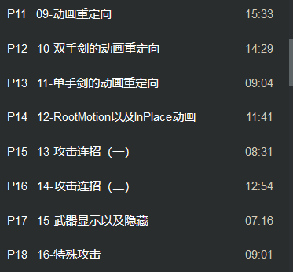

p11~p18

材质设为透明

动画资产重定向

重定向可能会由于不兼容而不显示骨骼 可取消钩尝试

rootmotion及其iinplace动画区别

//取消钩后可以看到角色的位移

N键激活播放蒙太奇

创建蒙太奇

当默认存放的是以下动画时

插入动画蓝图播放蒙太奇 (DefaultSlot)

创建连招蓝图架构 分支(按下b右键) 随后打算建立一个蒙太奇组合分支动画

建立蓝图分支

创建数据表格 Miscellaneous->DataTable

创建所选的结构的结构体

设定攻击逐帧动画的基本攻击蓝图

在是否连续攻击下 超过索引时置0 重新播放攻击动画

最终连接成(在动画播放时设定通知)

在不同帧下设定通知

初始化一系列数据

强转识别是否是玩家

执行到此时 在确认是玩家之后 进行一定操作

游戏加载前 初始化RowName

自定义变量 更改枚举数 定义函数ChangeEnumToName

以Sword模式为例 设置武器是否可视化 设置可视性(Set Visibility) //Is Start连上New Visibility
定义函数 ShowWeapon

加入到连击蓝图中(Is Start打勾)

连击事件结束初始化

右键触发蓝图分支判断角色攻击对象是否在攻击范围内

执行一次特殊攻击动画效果

在原本动画计数的蓝图中增加set

在普通的攻击动画中设定Rset通知

在角色BP中设定下两个节点 

在特殊攻击触发蓝图之中添加delay增加延迟效果 延迟0.2秒

