p19~p23

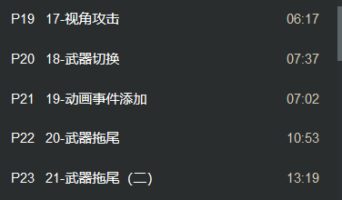

创建函数ChangeAttackView 使得角色在普通攻击和特殊攻击下随时切换角色的攻击朝向

在普通攻击蓝图中应用函数(打勾)

在特殊攻击蓝图中应用函数

最后在Reset中清除掉 清除数据

设定Table每个攻击的伤害数值上下限

设定damage输出伤害 使用random随机于上下限 输出最终伤害 

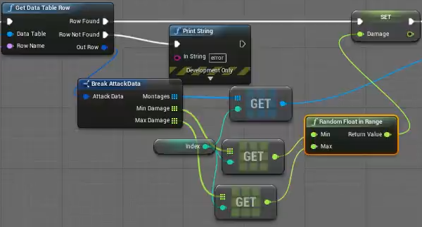

武器切换 设定按下N键不断反复切换两种武器

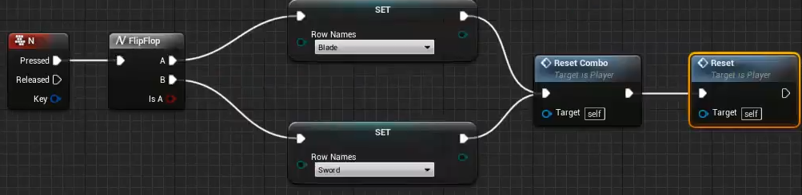

定义ChangeSpecialWeapon切换特殊武器蓝图

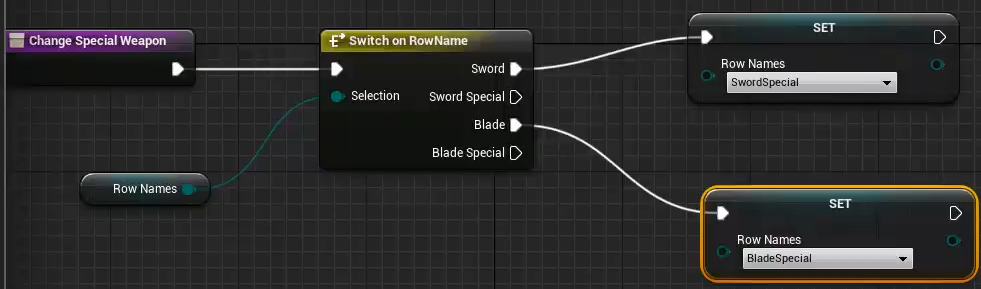

在特殊攻击中插入该函数节点

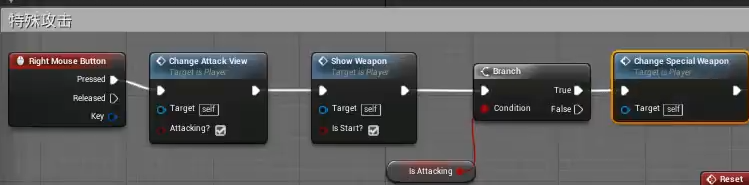

定义一个LastRowName存储每次结束动画后的状态

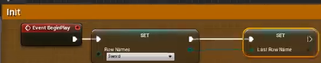

定义一个SetRowName 判断一下当前两者是否相等 不相等则替换此时的列名字

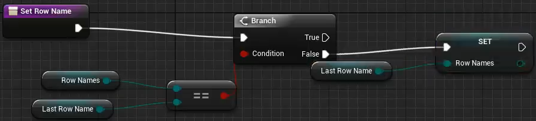

随后 跟进此时按下N动画时对RowName的改变

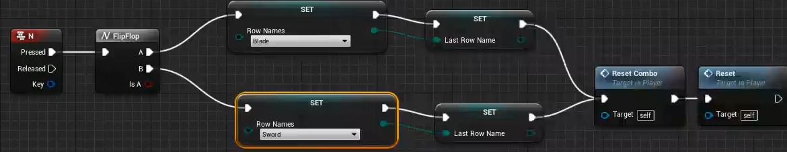

经过以上函数操作后 可以将原本普通攻击蓝图的set删除(此时选中的节点)

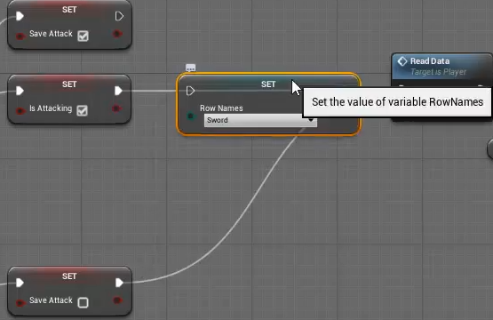

以及特殊攻击蓝图的set删除(此时选中的节点)

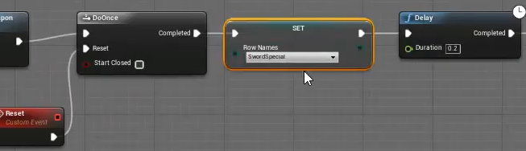

在Reset分支中 将SetRowName进行重置

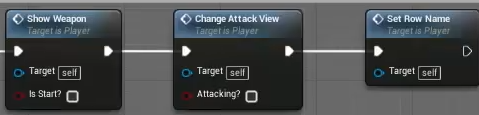

在Blade中的蒙太奇动画定义同样的通知

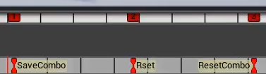

在Reset分支中定义重定向Damage伤害值

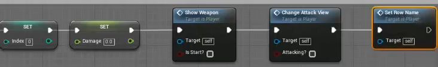

收紧选中节点

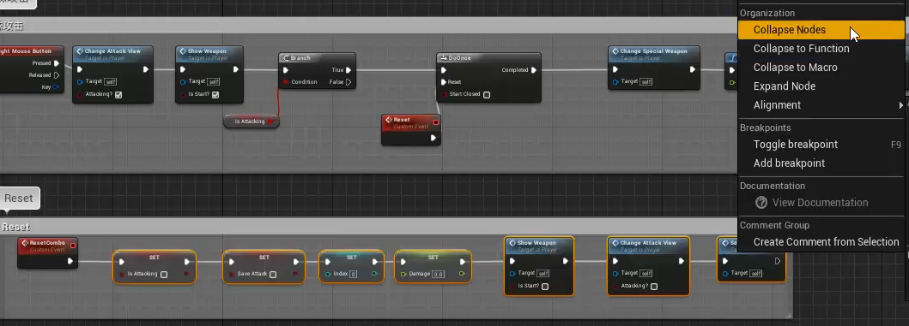

最终合并成单个节点(双击此节点可以查看细节)

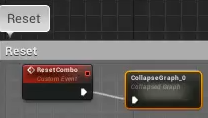

武器拖尾特效 增加通知轨道2(轨道仅是层级关系 并无实际效果) 添加节点Trail 可以设定特效 两个name分别是特效头和特效尾的位置名字

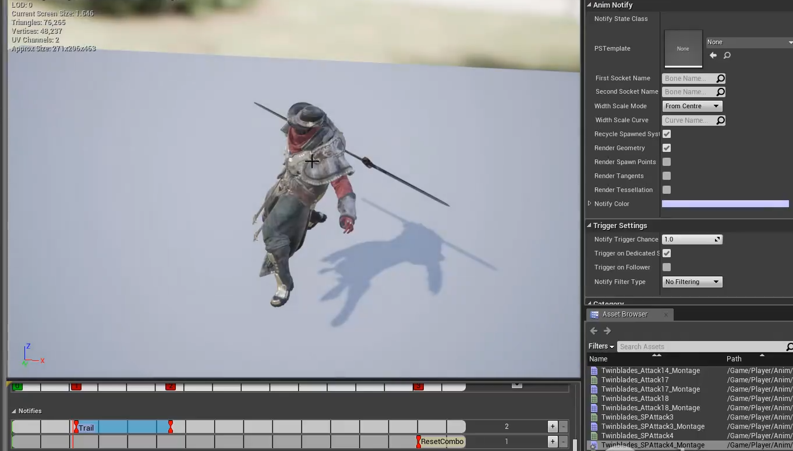

设定所选特效和特效头尾后 在轨道2的Trail节点中会显示武器特效

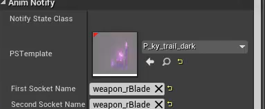

粒子特效 在此位置出现

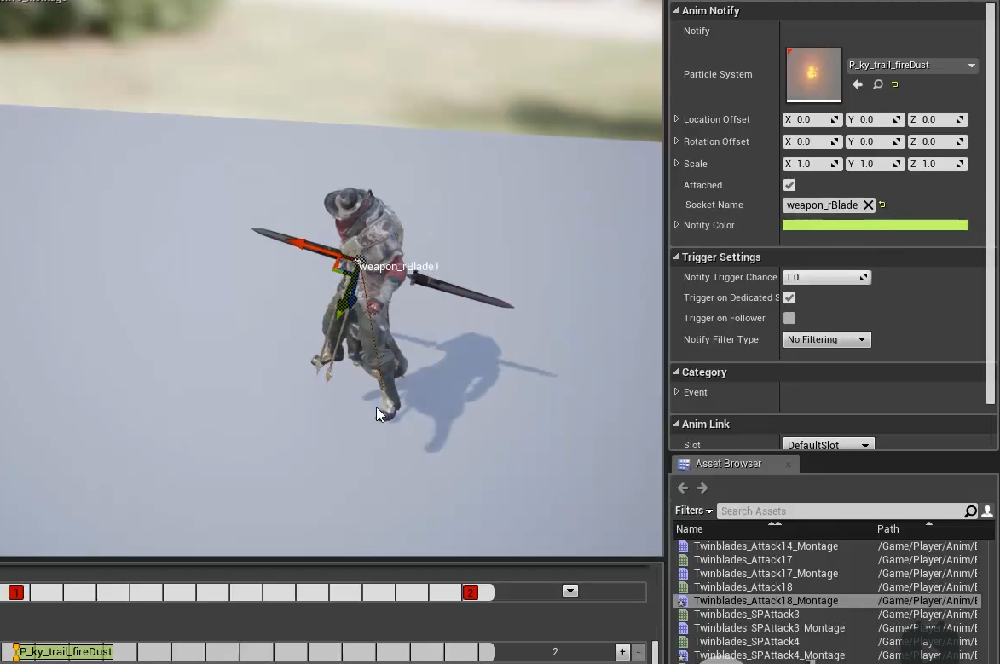