p24~p27

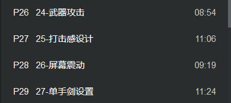

人物碰撞检测 Ignore忽略(直接穿过) Overlap重叠(穿过有触发响应) Block(无法穿过)

Object type碰撞类别 (Custom可以自定义)角色用Pawn

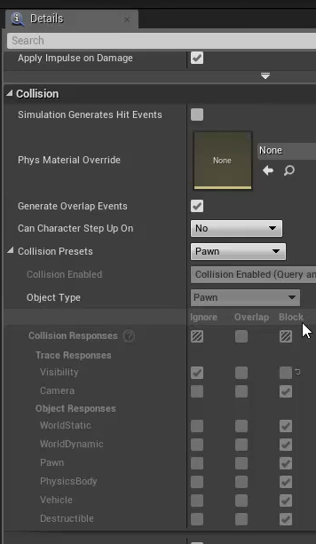

碰撞检测 若两个物体要发生碰撞 需要两个都设定为Block

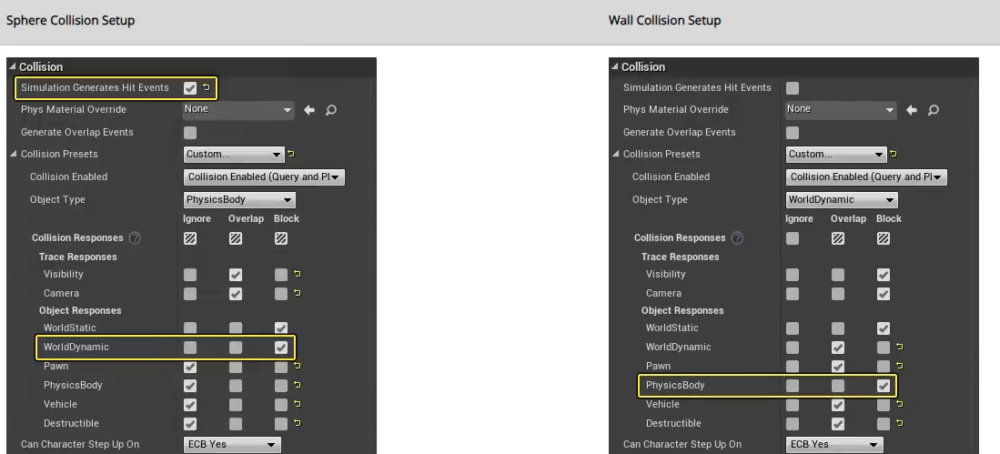

触发检测

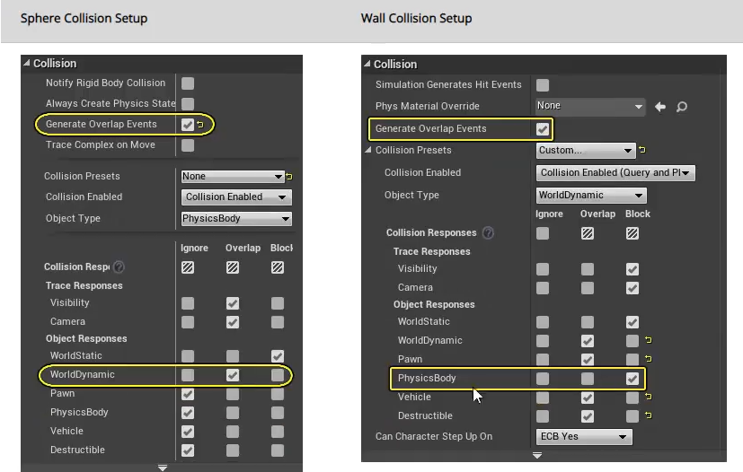

A和B物体之间选择的关系

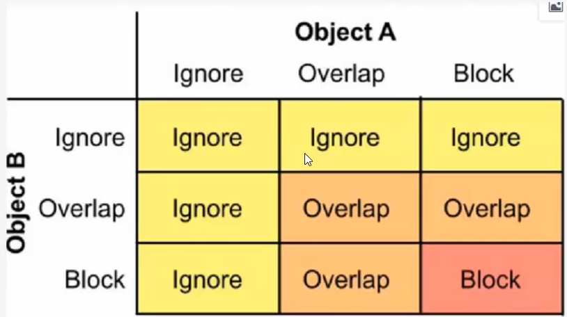

角色武器添加碰撞盒 在特定动画 显示武器是否碰到敌人(然后造成伤害)

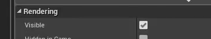

左上角添加组件 胶囊体碰撞组件

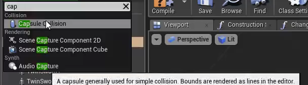

胶囊体属性填入武器组件的名字 可以让组件附在武器模组上

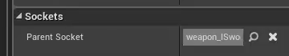

设定自定义碰撞 在碰到pawn时 触发触发响应

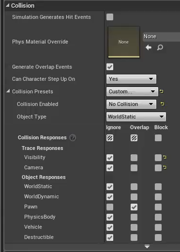

第一个 碰撞都不会生效

第二个 仅发出询问反馈状态 射线检测 扫描

第三个 物理约束的状况

第四个 包括第二第三

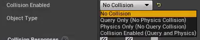

武器攻击碰撞逻辑 碰撞的开启/碰撞的关闭 (Sword R/L表示双手剑对象)

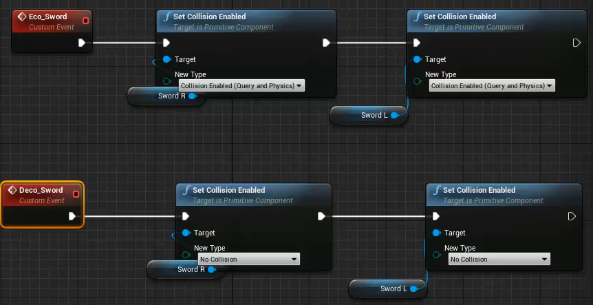

在角色行为动作中 添加动作轨通知 Eco_Sword 和Deco_Sword表明角色在哪些时段触发武器的碰撞效果

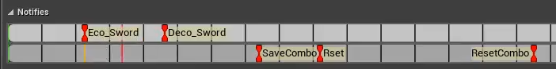

player的BP 事件图表中

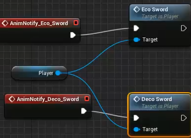

选中SwordL 和右下角的事件触发 当触发检测时候触发的事件蓝图节点

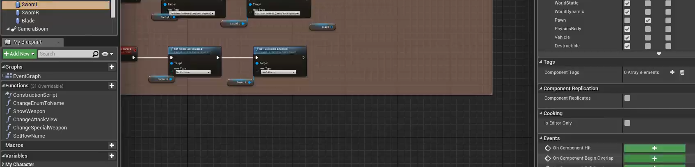

注意 不要忘记触发与被触发物体碰撞组件的判定(打勾)

测试效果 并且打印出Damage(伤害值)

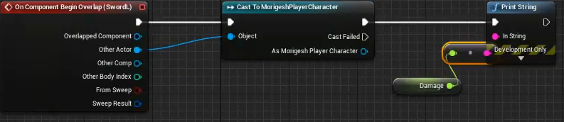

双手都写上触发的效果蓝图

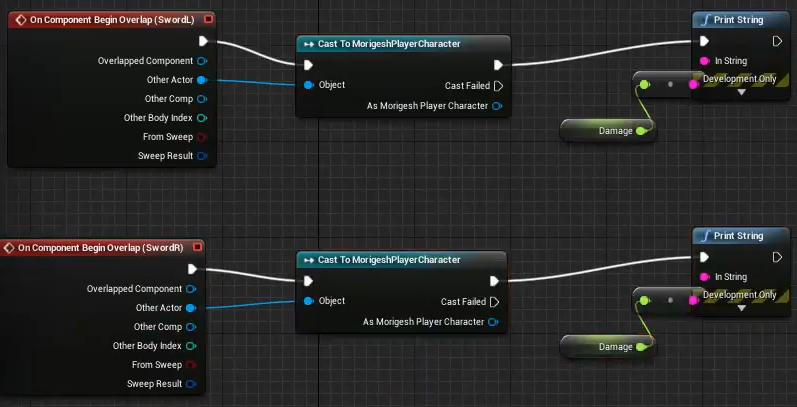

会发现以上的动画触发 一次攻击触发多次打印效果 因而需要设定一个触发单次触发效果的节点 Do once

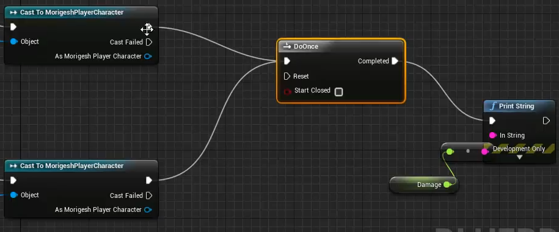

创建事件

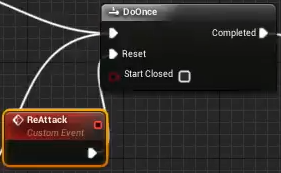

最后添加一个事件Re Attack

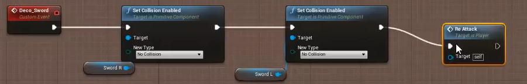

自定义事件 Set Global Time Dilation 控制时间(默认是1 目前设置为0绝对静止)

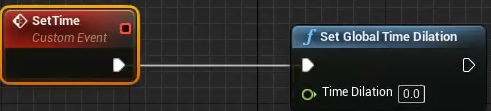

事件触发后 事件变成0.3 0.2秒后 恢复正常

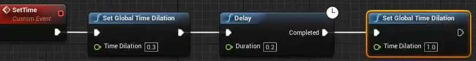

AttackEnemy变量是否打中敌人 只有打中敌人时候 (set 打勾)

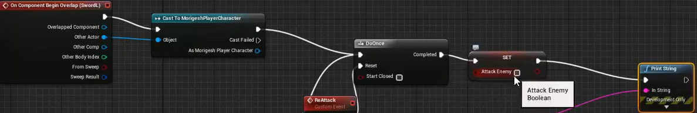

在武器的碰撞器关闭之后 取消判定(set 不打勾)

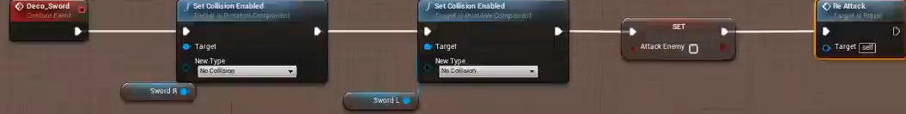

判断此时事件触发后 是否打中敌人

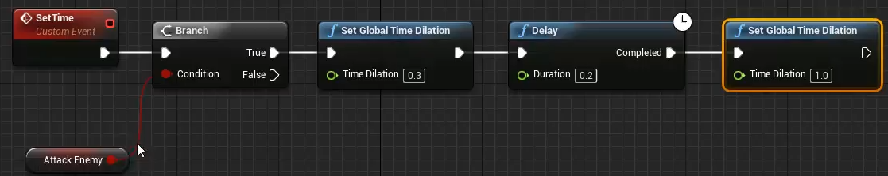

动作中 插入通知Eco_Sword Time和Deco_Sword(图有误)

记得BP中调用Time事件

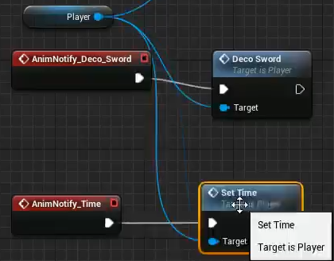

屏幕(相机)震动 新建蓝图类 震荡UCameraShake

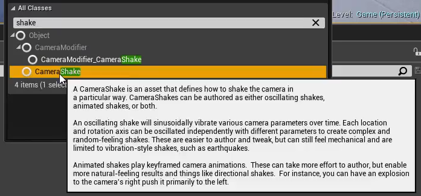

晃动镜头蓝图

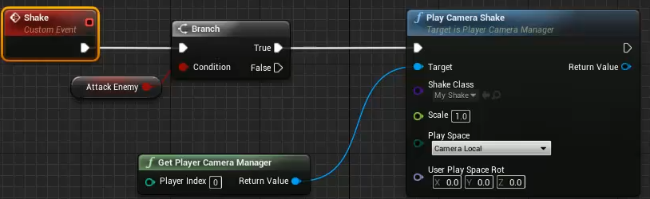

PlayerBP事件定义 (Player对象指向Target)

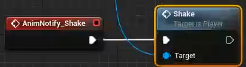

怪物不与Player的camera碰撞 即可避免摄像机与怪物碰撞

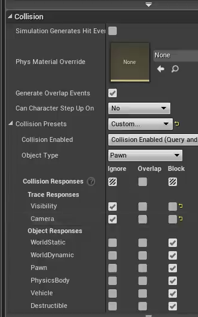

将Scale振动值设为变量 设为1.5

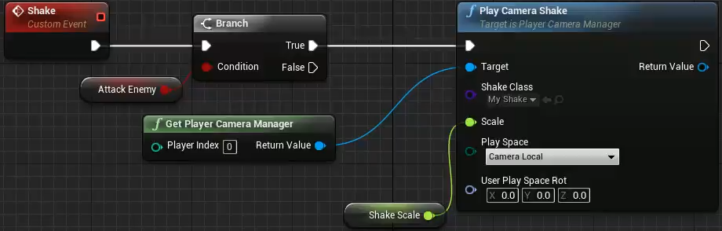

单手剑设置 两种触发情况

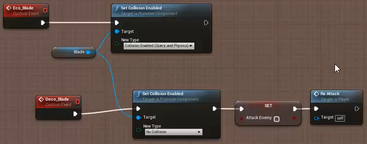

对左下角的Balde碰撞组件定义事件链接原本的节点 定义为触发检测

并且在单手剑的攻击动画中添加轨道2的通知

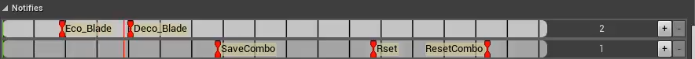

在PlayerBP中定义事件 Player对象指向Target

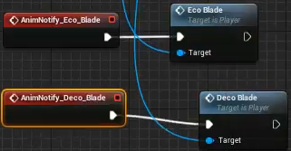

特殊攻击同上 不赘述
