p28~p33

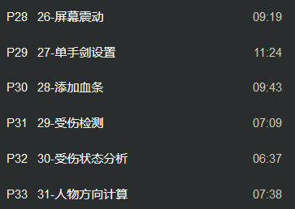

添加血条 创建UI

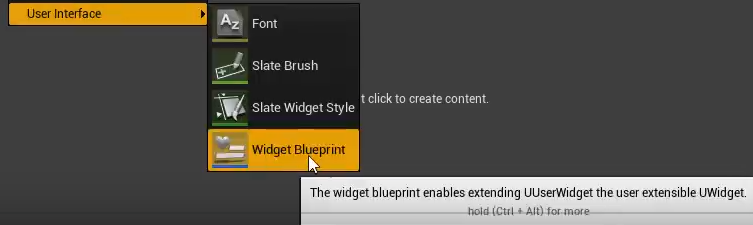

双击打开后 对画布进行设计 将左上角progress bar拖下去设为血条

Text同理 可以作为文本实例

在Player中添加float的Health变量和MaxHealth变量(作为血量条)

并且将原本的Reset中的合并节点中 重新多重新定义

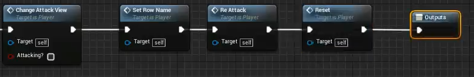

在init初始化之中 将Health定义为MaxHealth满值血量

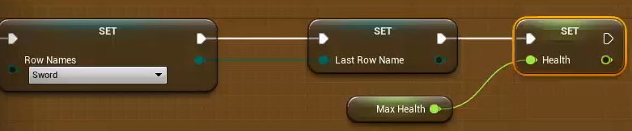

在UI的Progress Bar下 添加对能量条浮动绑定创建函数

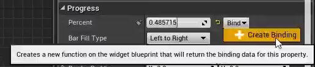

将现有血量/最值血量相除可得血量百分比且输出到能量条中

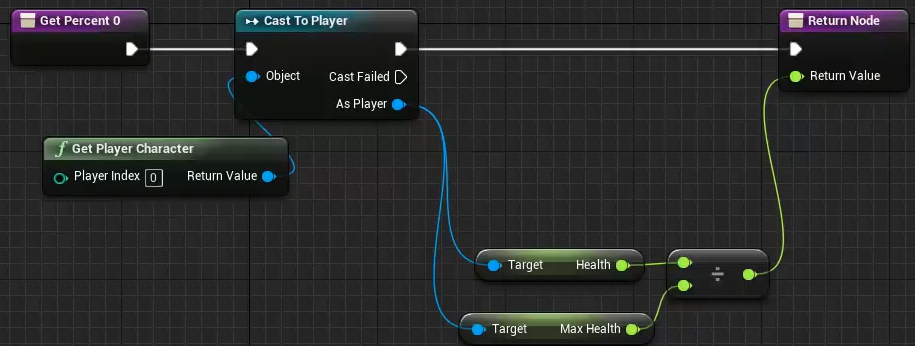

在Init初始化中 将UI节点连接 游戏中展现UI

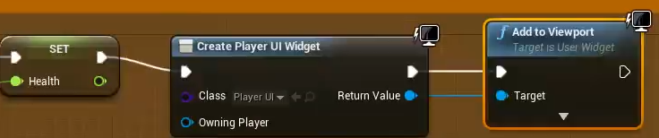

将Player中的Health和MaxHealth变量剪切到怪物的蓝图中 右键创建怪物中的变量

按下P右键 创建开始事件初始化蓝图

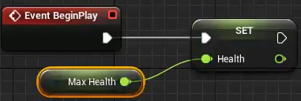

将PlayerUI复制一份给Enemy 修正颜色值位置等 给EnemyUI的能量条创建绑定 设定血量的蓝图UI

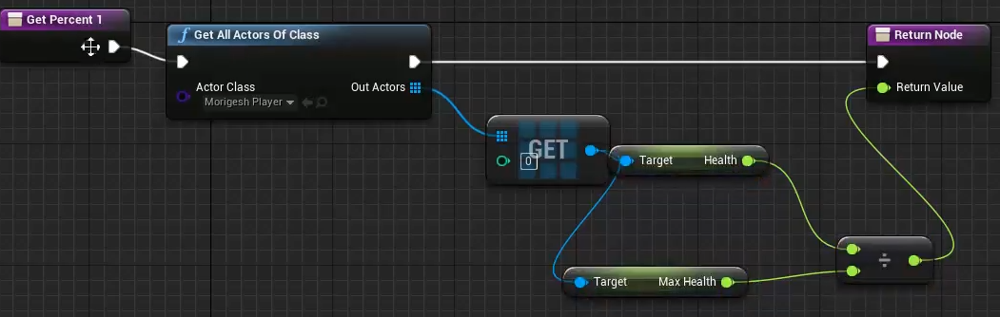

在Enemy的时间中定义 写好的UI

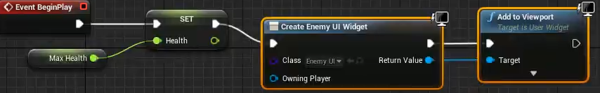

受伤检测 在之前的Player攻击触碰触发检测中 set到碰撞的怪物对象 存储为Enemy变量

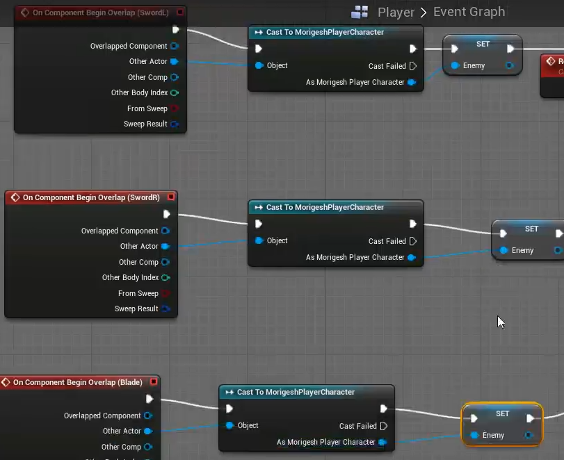

随后 在之后进行伤害判定 对象为Enemy 受到的伤害为Damage

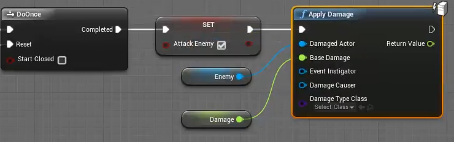

在Enemy设定中 先设定怪物此时存在(还活着) 定义变量is Alive

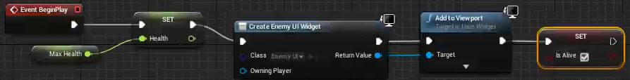

添加受到伤害的事件 在怪物存在时 进行伤害判定

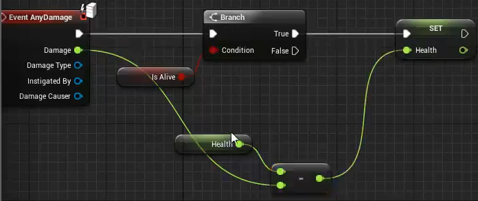

随后在set后 与0进行比较 如果小于等于0则进行死亡操作(先空着)

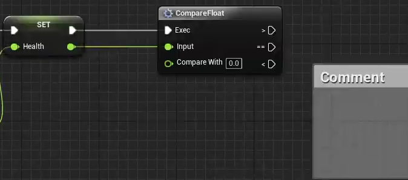

在Player中定义受伤蓝图 (Danage连接到与Health相减)

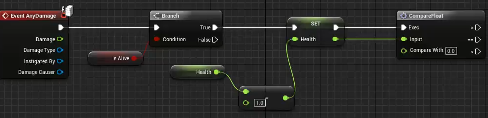

虚幻引擎设置中 Maps&Modes (游戏和模式)打开时显示的map 当游戏打包出去第一次启动游戏的初始关卡

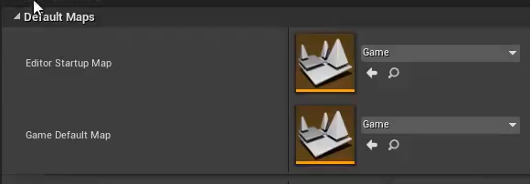

游戏设定的默认模式(自定义)

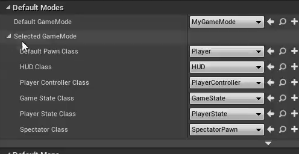

Enemy受伤状态分析

人物方向计算 

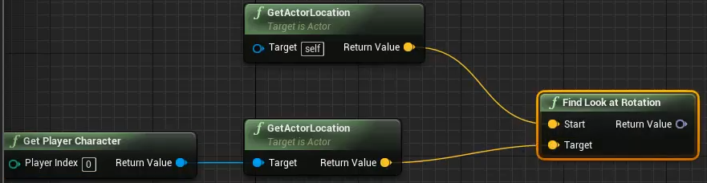

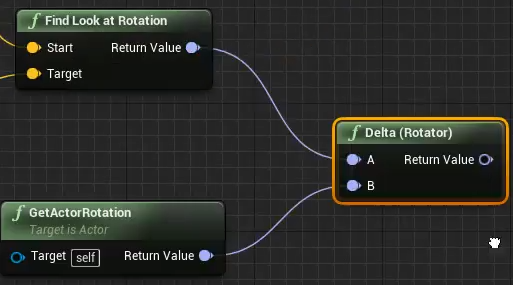

打印敌人的旋转值

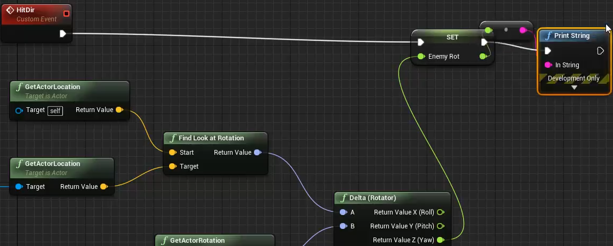

tick事件调用 最终打印出的是旋转角度(角度是以Enemy为时钟12点顺时针开始计算角度)

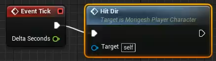

此时蓝图宏观

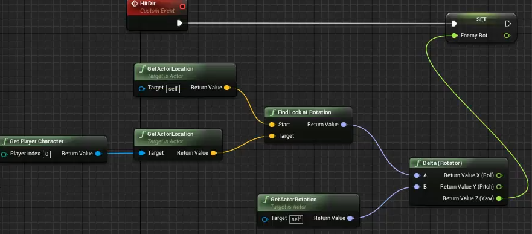

在小于等于50 大于等于-50之中 即为可视范围内

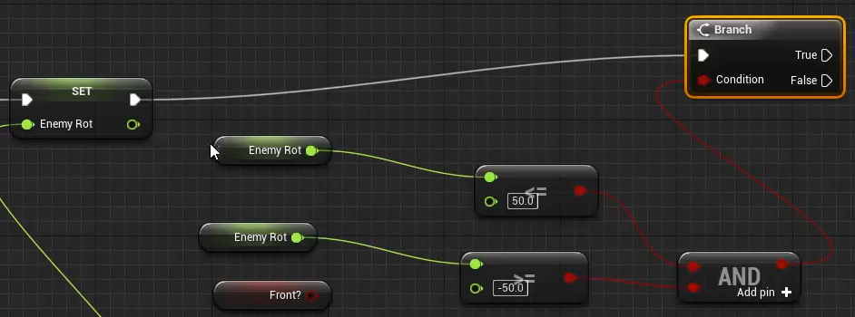

最终 在Enemy视线内打印True 视线外打印False

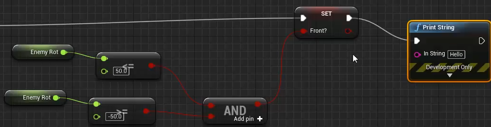

目前

