p34~p38

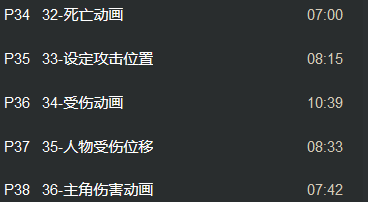

开启HitDir事件判断方位

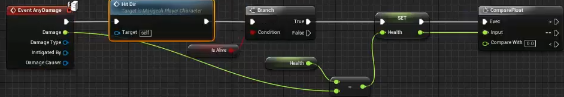

建立分支 并且以方向存储变量

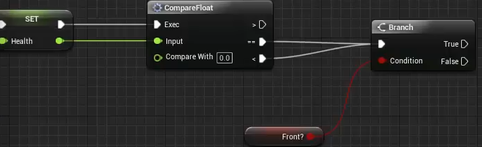

LaunchForceRight LaunchForce JumpForce JumpForceRight四个变量

如果在前面 就以...来播放蒙太奇

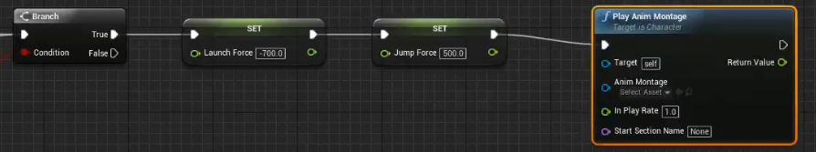

创建向后倒的蒙太奇后 修改该蒙太奇的插槽属性 随后在播放蒙太奇节点上 设置Anim Montage

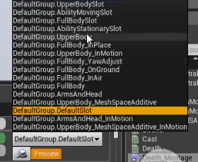

等待一段时间 销毁Enemy

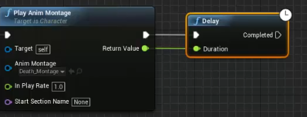

Enemy死亡动画后 让Enemy变成布娃娃形态(瘫软无力状态)

例如在角色的物理资源中 可以看到pelvis设定

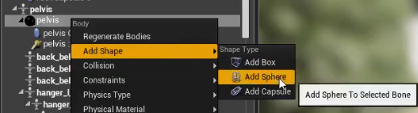

随后开启布娃娃系统动画 用Mesh模拟

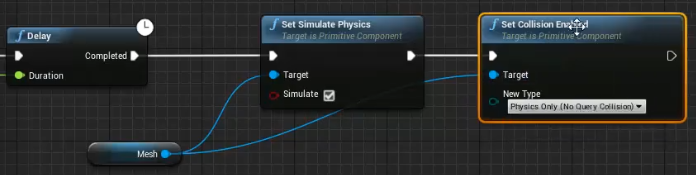

最后 删除胶囊体

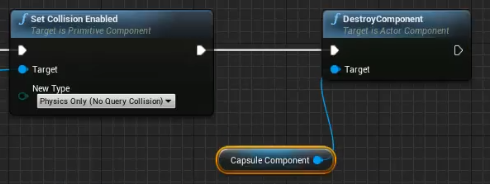

算上Damage计算

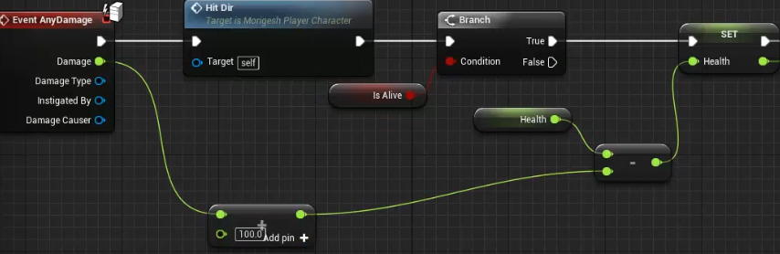

测试后 重新修改节点

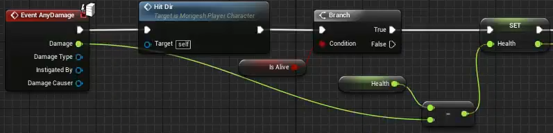

最后将IsAlive设置为false 判定死亡

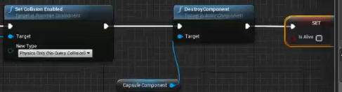

Init中 默认Is Alive 是true

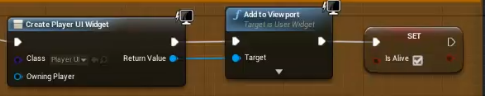

将另外两个变量设为0

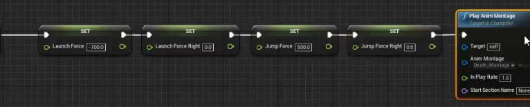

在背面的节点

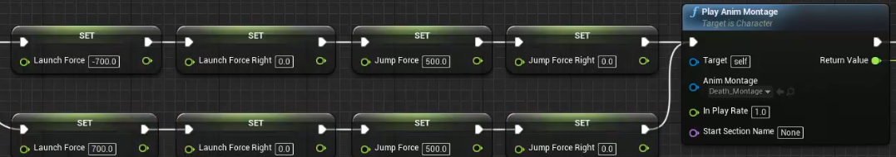

血量大于0的动画  先让其暂停 进行设计

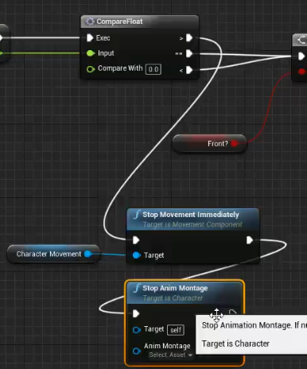

最后在判定 在存活的情况下进行相应的判断

在AttackData中创建一个Nam而变量的AttackName数组 攻击对象

随后在AttackTable中设定AttackName每次击中后播放的动画的攻击方向(用于播放Enemy相对应被击的播放动画 打击感)

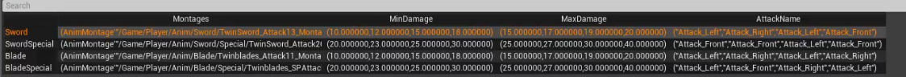

在数据读取的节点中 读取设定的变量

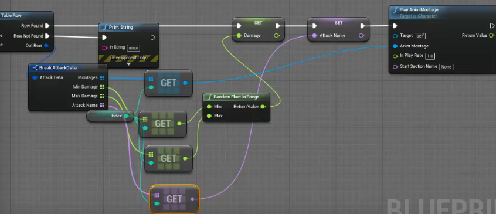

随后在Enemy中获得Player中的变量 播放相应的动画

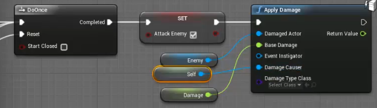

将DamageCauser强制转换 变量设为Player

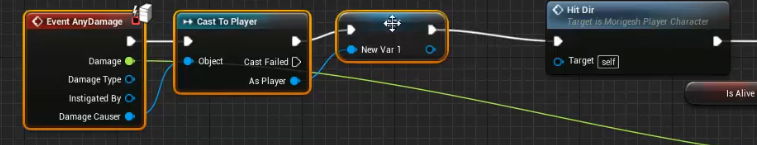

在Enemy血量大于0的情况下的分支中 获取Player的AttackName

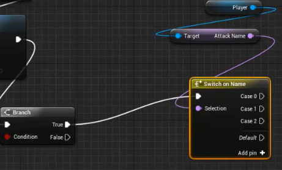

随后设定switch的分支 并且修改相应四个变量 再与蒙太奇动画变量相连

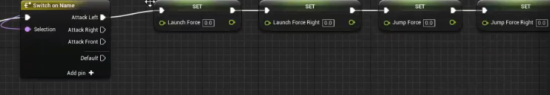

在向左攻击 向右攻击 向前攻击中 修改响应变量

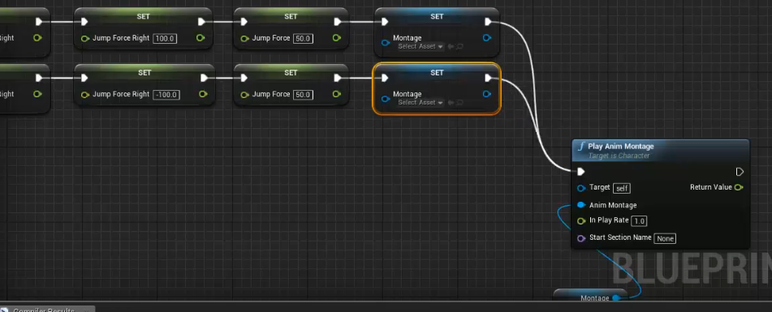

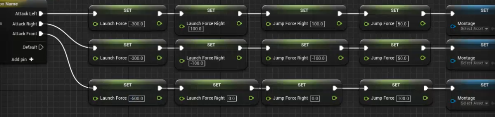

相连且保存MonTage为变量

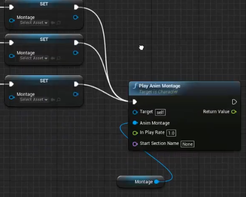

随后 将受伤的动画设为蒙太奇 且修改动画插槽

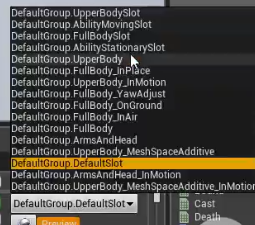

在set中 将蒙太奇选项设为相应的动画蒙太奇

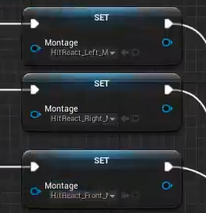

随后copy到另一个分支里 (背对的情况下) (所有数相反)

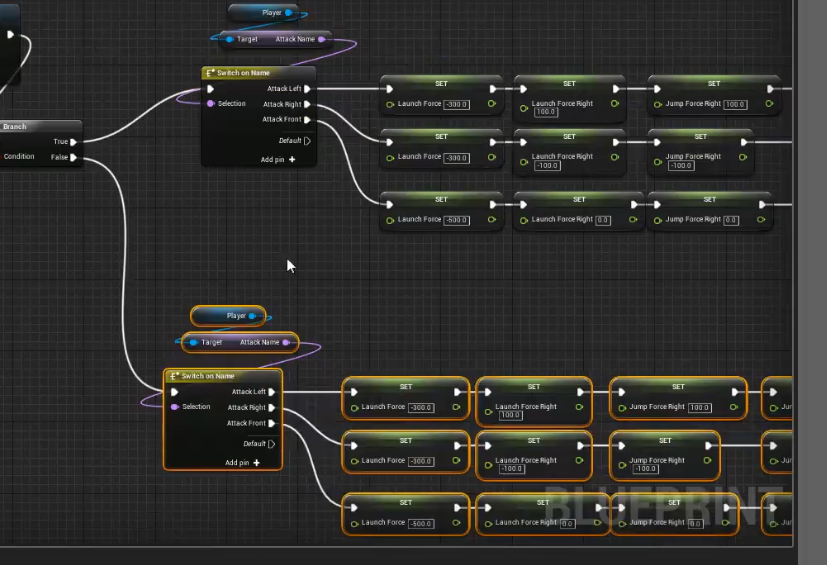

最终连上Player Anim Montage

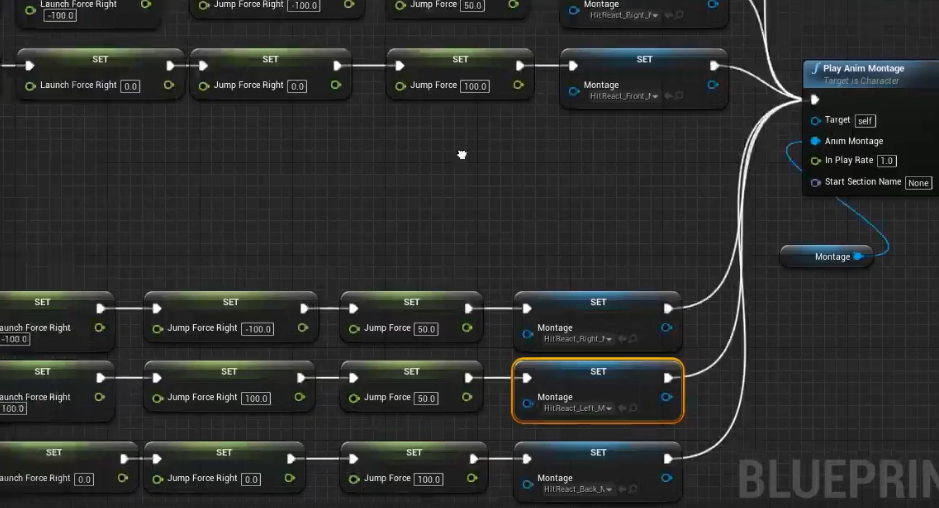

用动画的蓝图

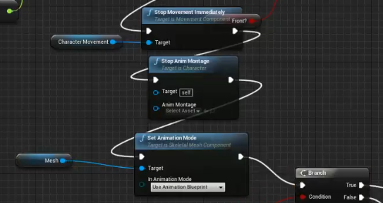

人物受伤位移 蓝图分区注释

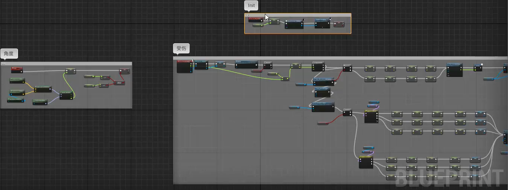

自定义事件起飞 Launch 写入三轴向量 分别相乘向量再相加 输出最终被击飞的飞出向量的蓝图

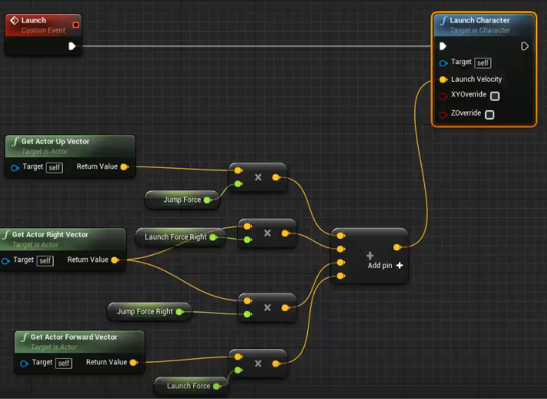

设定布尔值 是否在空中 Fling状态 在动画中调用通知 放在飞出去动画的那一帧

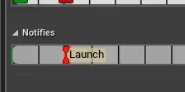

在动画蓝图中的事件图标里调用 因此需要定义一个函数获取自身的蓝图

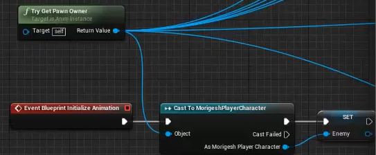

动画事件蓝图

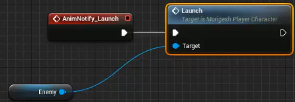

主角受伤害动画 根据血量不同播放不同动画

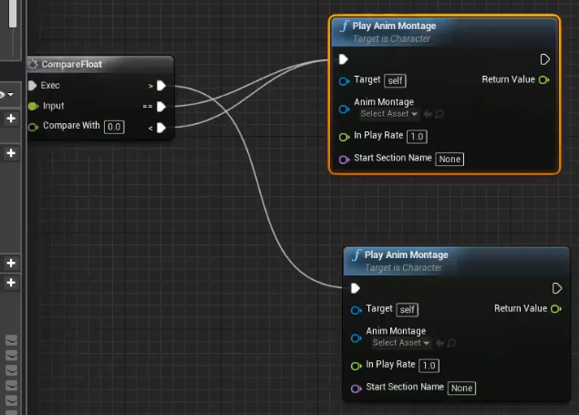

将受伤动画设为蒙太奇 血量低于0的时候 一定时间后销毁

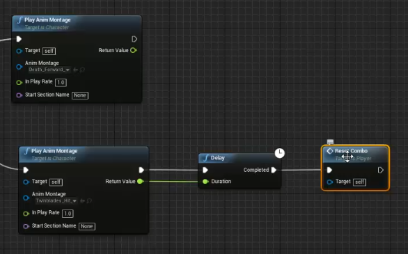

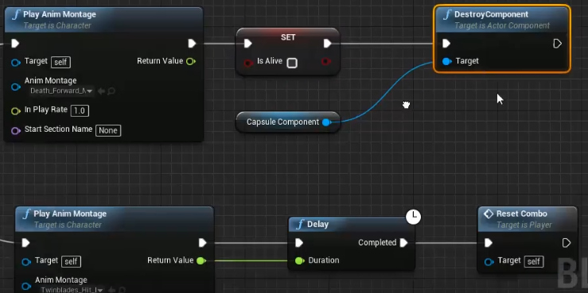

因此 攻击事件触发时 需要判断角色是否存活

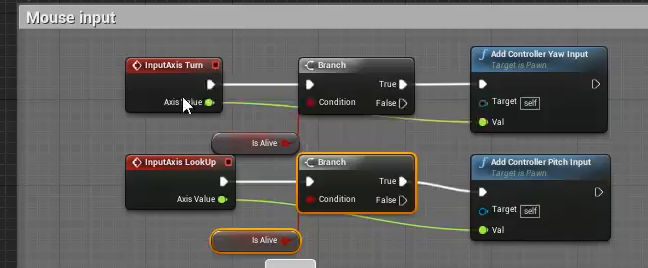

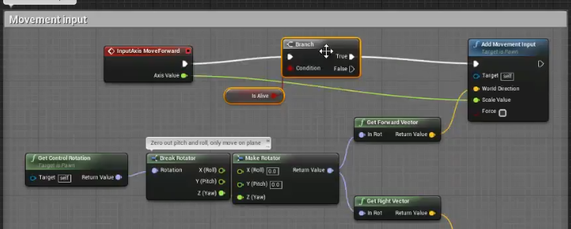

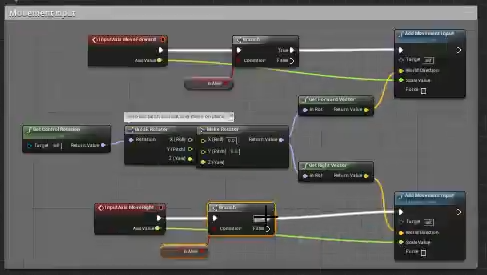

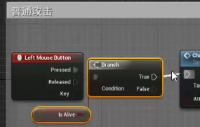

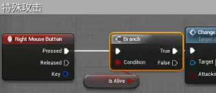

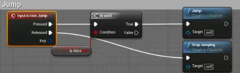

倒下后又起来了 播放蒙太奇是一个播放状态 并不是持续播放 因此需要持续播放 并且可以做一些动画组合

添加一个loop组合 并且双击 将其变色

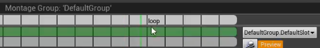

最后将一直播放loop后的动画

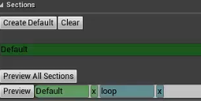