p39~p41

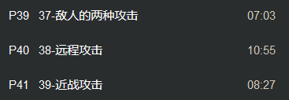

自定义事件Attack01 远程攻击 新建变量是否正在攻击IsAttacking

希望攻击状态下 平滑朝向攻击的角色

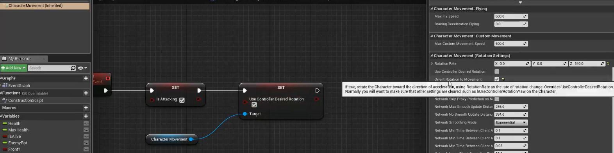

另一个关掉

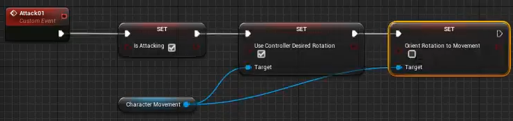

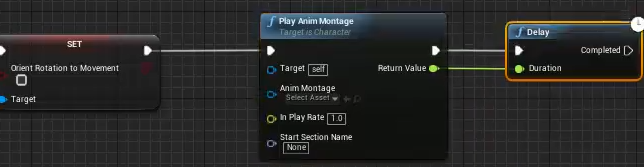

过段时间再设置false

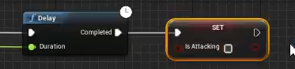

变量再设为原来的状态

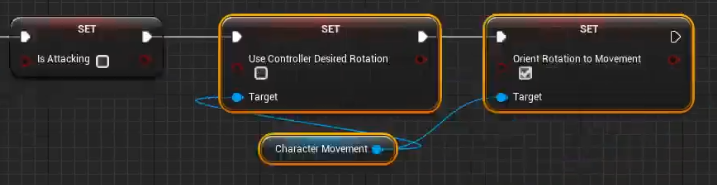

随后Ctrl+w copy下 修改播放的蒙太奇 设为不同的攻击模式

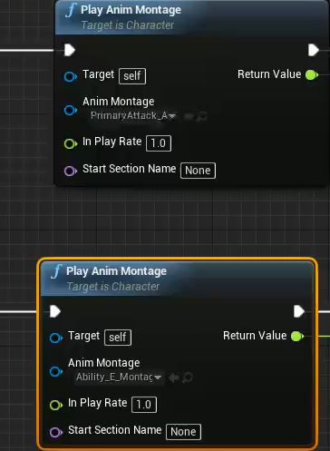

要让Enemy动画有位移 增加Launch的通知即可

要割裂Enemy的默认动画裁剪 选中片段后可以调整边界限

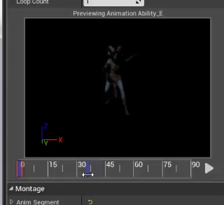

远程攻击 选定资料中的粒子特效 生成粒子系统

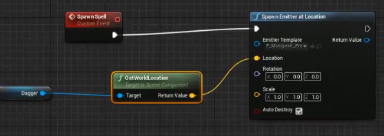

生成蓝图类自定义事件

新建Actor蓝图 添加ProjectMovement 有初速度的组件 设定

透明组件Scene放到球体上 即替换消失

PartickSystem粒子特效组件

StaticMesh 静态组件 碎片

Sphere 球体碰撞盒

最后将此class放入SpawnActor Spell中

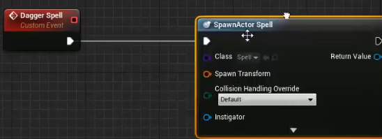

调整其位置 要朝向玩家的位置

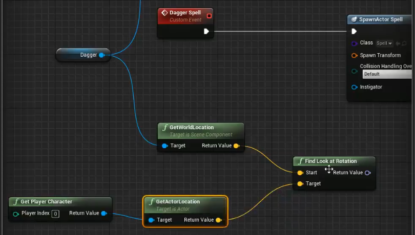

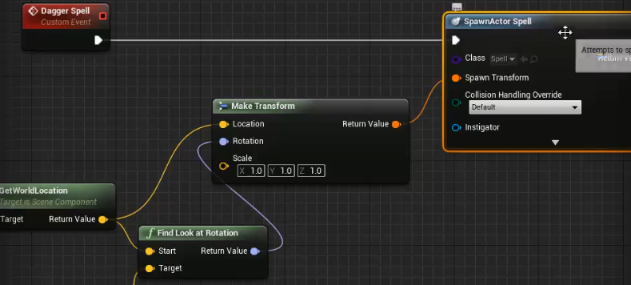

添加动画中 丢出去的东西时的通知Dagger Spell

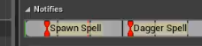

在任务蓝图中实现人物事件

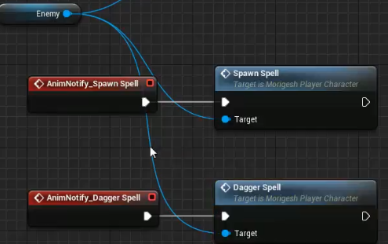

设定投掷物体的速度

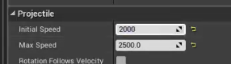

投掷物体添加碰撞信息 设为自定义与pawn重叠碰撞且产生重叠事件

添加碰撞触发检测

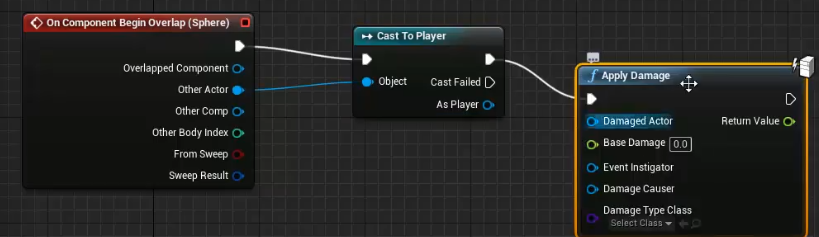

且设定延迟

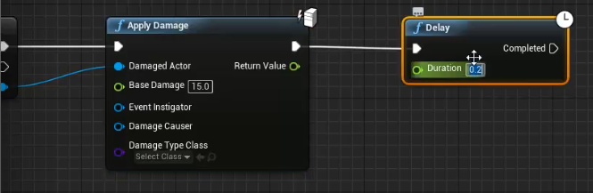

生成粒子系统

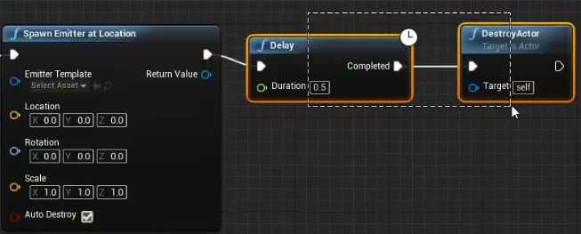

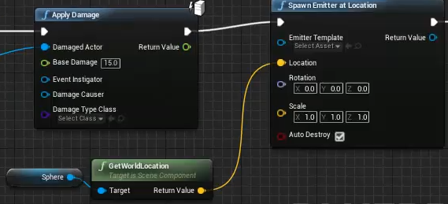

碰撞信息检测设置

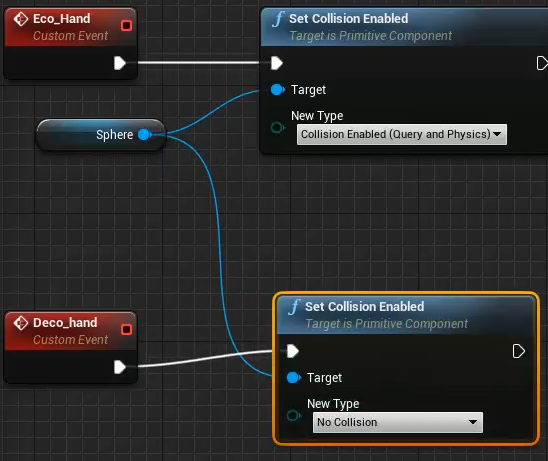

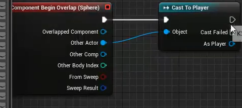

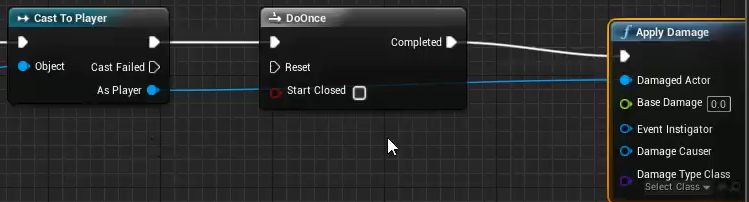

新建两个变量设定最大最小伤害 MinDamage MaxDamage

进行随机伤害

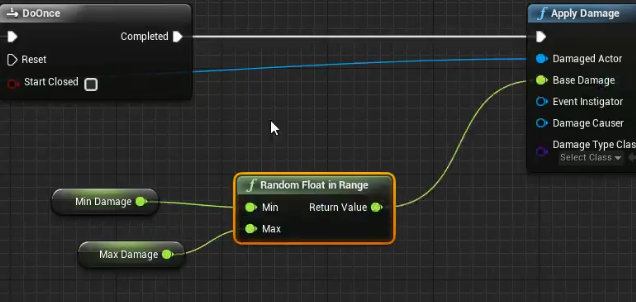

Reset自定义事件

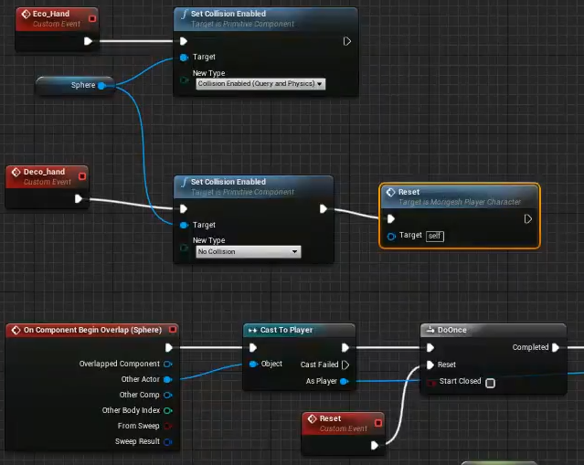

设定动画中 通知eco_hand 和Deco_hand 设定动画中 判定的范围

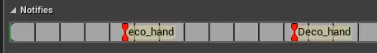

回到动画蓝图中 将BP事件图表中设定事件

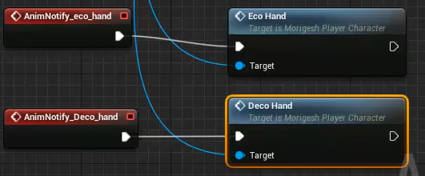