p42~p50

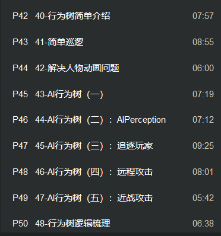

敌人AI编写 行为树

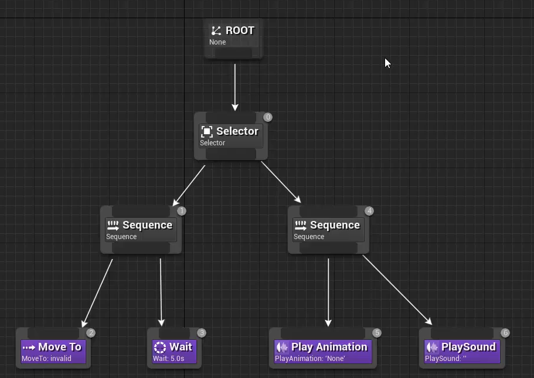

分支节点 

选择 依次从左到右 第一个孩子返回成功后 其他不会执行
顺序 依次顺序执行子节点 其中有一个不执行成功则不执行成功
并行 一次性执行很多

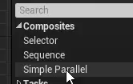

复合节点 任务节点

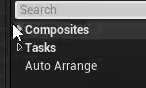

装饰节点 不能作为节点存在 必须附着在节点上 右键节点后 可以选择 用于检测子节点是否可以去执行或者终止

服务节点 ue4延申

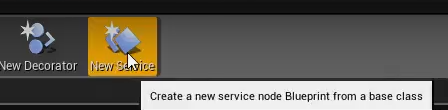

实时更新

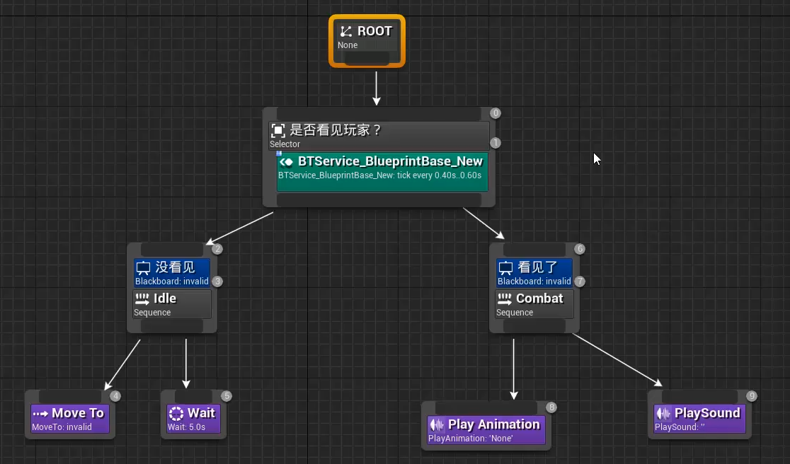

打断选项 是否打断 1.不打断 2.打断自身 3.打断其他节点 4.全打断

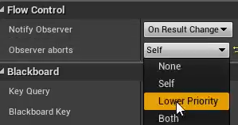

简单巡逻 创建人物AI AI三大: 行为树(AI行为大脑) 黑板(AI内部数据) 蓝图类AIController

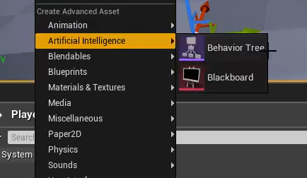

行为树关联黑板

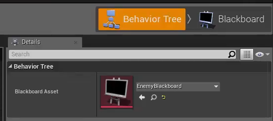

在Enemy蓝图中 修改AI Controller Class (自己写定的AI Controller蓝图类)

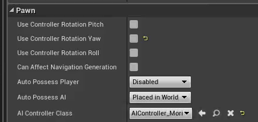

随机移动的效果 在黑板中设定 Target位置

设定序列 创建任务 

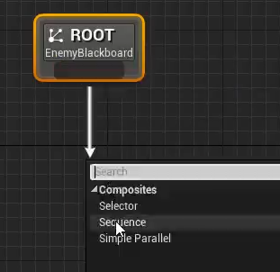

写一个方法行为树

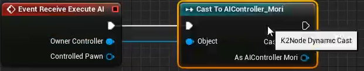

Radius设定运动范围半径

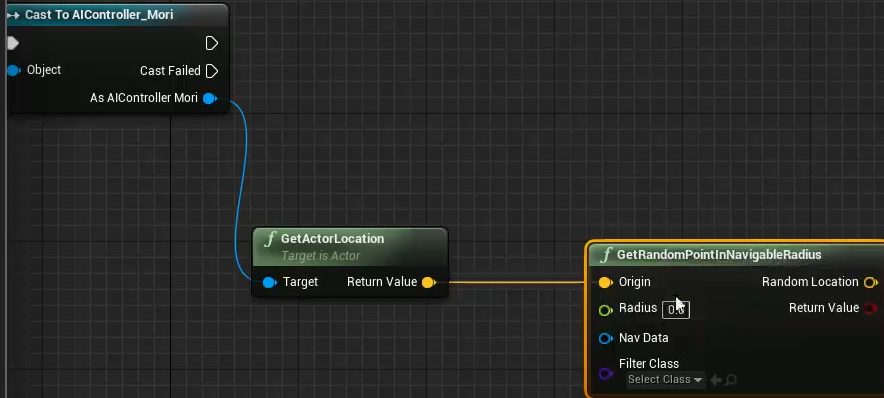

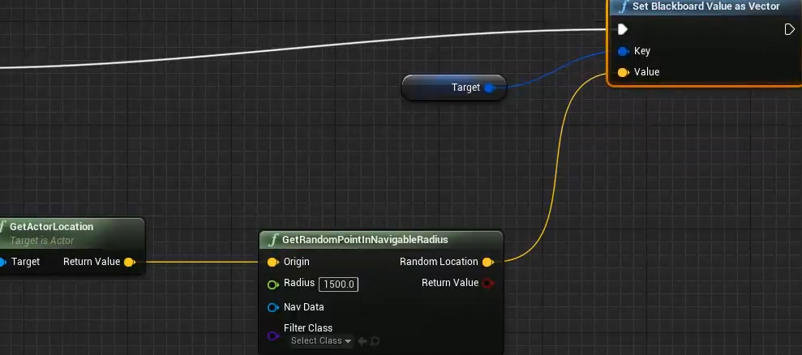

创建 new task 命名为BBT_RoamLoc

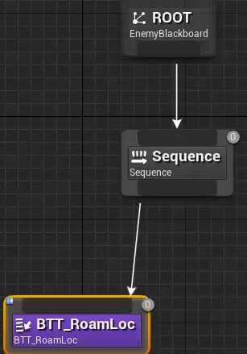

数据可视

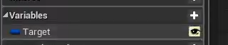

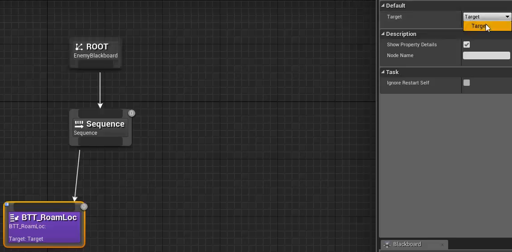

执行完随机巡逻后 停置三秒

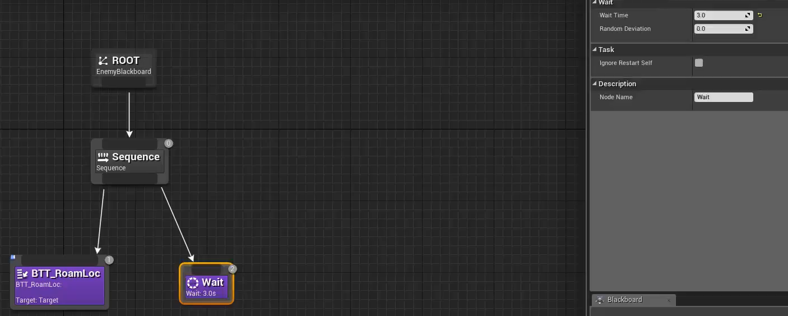

注:要巡逻后 返回成功执行

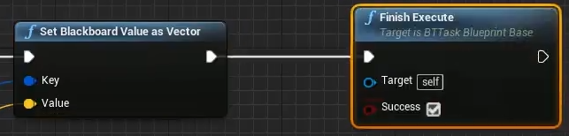

run行为树

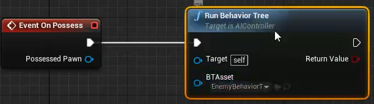

放置场景中烘焙 按下P键可以看到绿色范围为行动范围

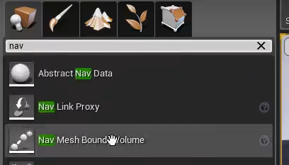

增加移动行为(目前仅平移 并无行走的动画)

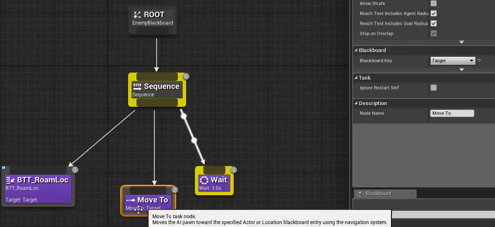

原本的Enemy 默认行为树蓝图

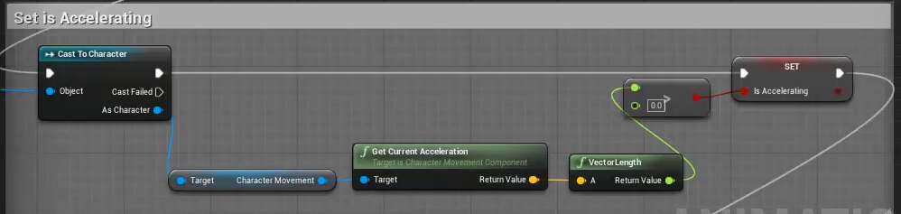

用speed来判断Enemy是否在加速

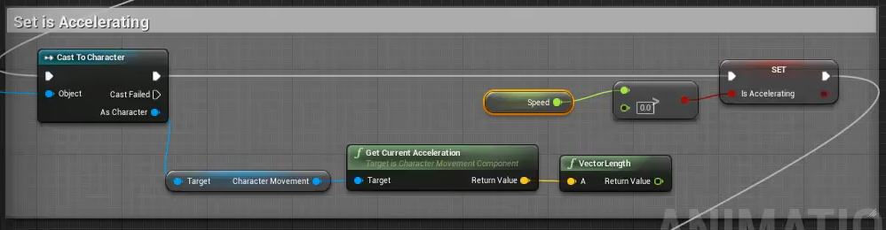

新建 new service 命名为 BTS_Fling

自定义事件 受到攻击 和攻击结束事件

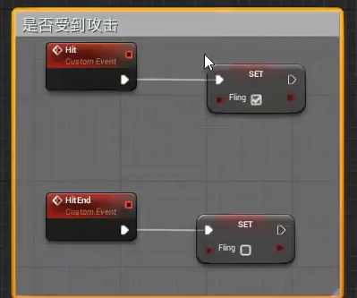

在蒙太奇动画中 添加动画通知Hit和HitEnd

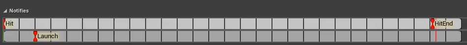

添加到BP事件图表

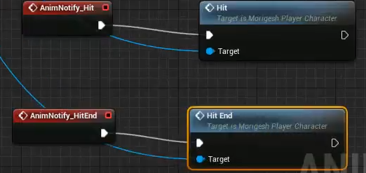

服务节点 实时判断当前是否受到攻击 访问到人物蓝图变量 黑板中也要持有相同变量

在黑板中设定同名变量

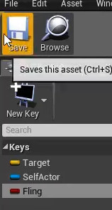

在AI开始运行行为树之前 先把人物蓝图持有 并且设为变量存储

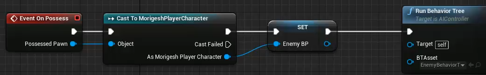

新建自定义事件 用于在服务中调用 当前是否在攻击状态 

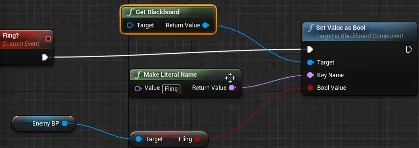

在BTS_Fling中 每帧调用 在左上角function中获取事件

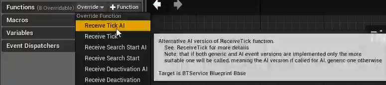

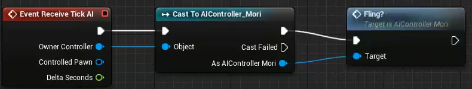

在黑板中创建变量

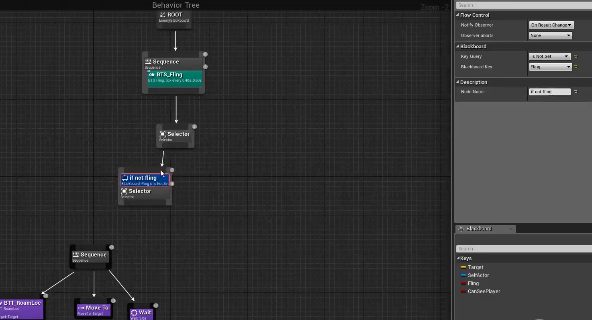

创建BBT_Dontmove 定义其中

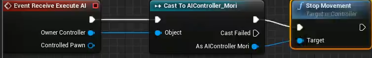

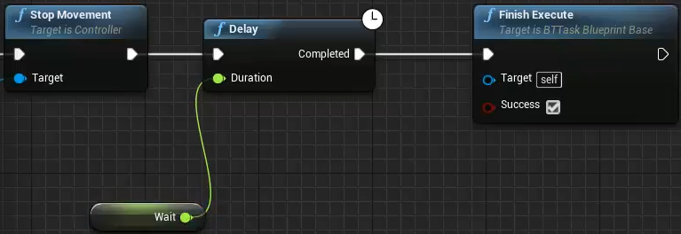

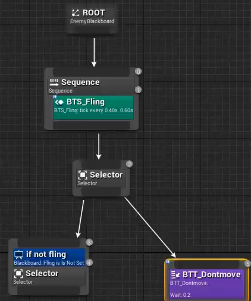

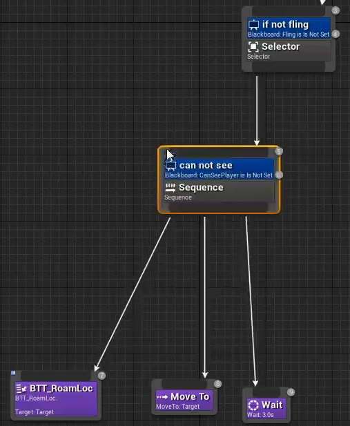

AI行为树 添加新组建 AI的感知系统

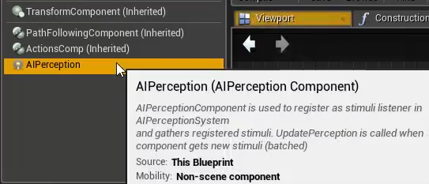

AI 伤害 听力 预测 视力 团队 触摸的感知 选择视力感知

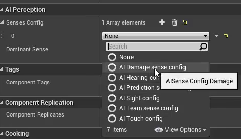

视野距离 失去视野距离 视野角度 

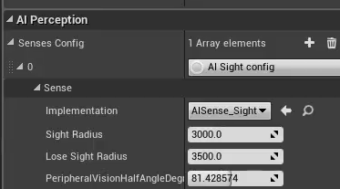

检测阵营 

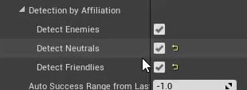

更新感知事件 想感知的Actor  返回感知信息(是否成功感知(看到等))

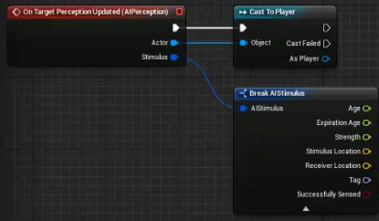

获取黑板的数据 Set Value As Bool

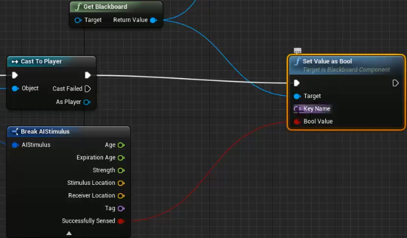

从黑板中 获取需要得到数据的变量名字 放到Key Name中

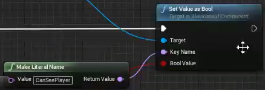

两个节点设为Both 可以互相打断

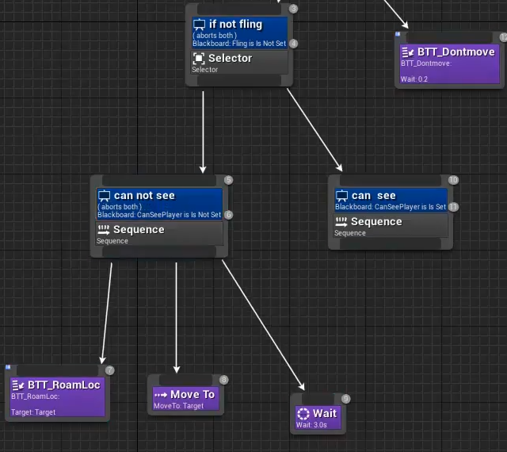

追逐玩家 创建新的行为树节点new task事件人物 BTT_MoveToPlayer

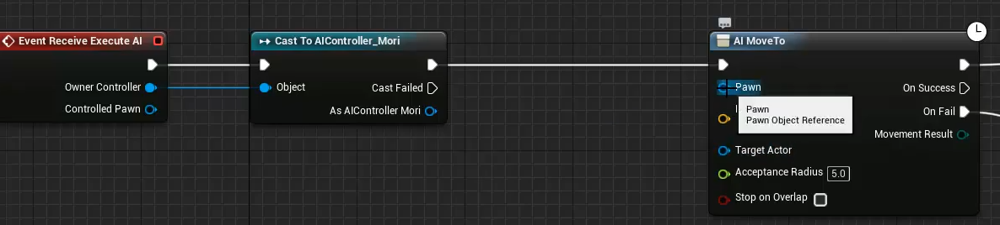

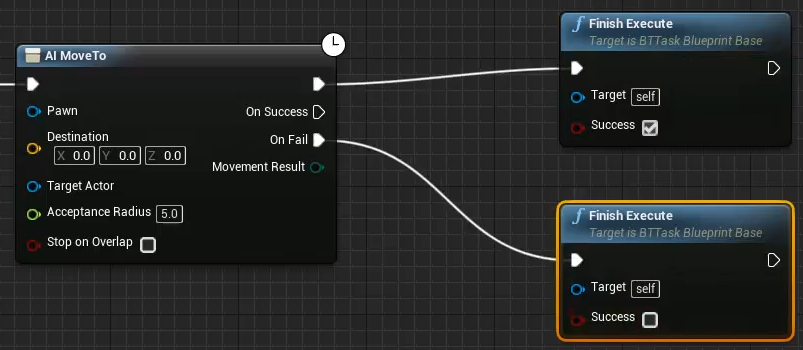

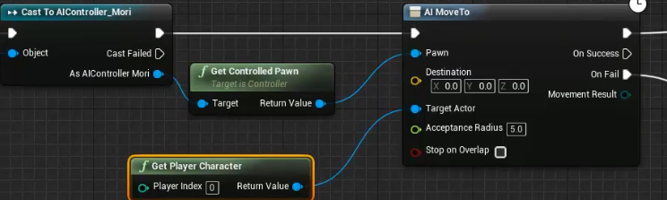

事件距离

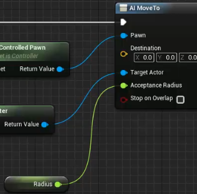

添加延迟 增加反应时间

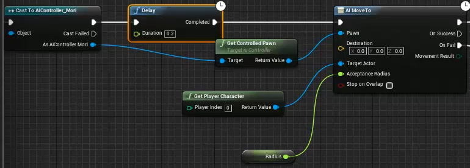

将行为任务添加到行为树里

重新创建new task BBT_SetFocus 让Enemy始终朝向角色

Enemy持续看向的目标 角色->new focus

在Enemy蓝图里写两个函数 修改移动速度 (看到角色后移动速度变快)

在AI toolbar中持有该事件

在BBT_MoveToPlayer中调用run

补全行为树

如果切换到了看见->没看见 则会便会walk则要进行修改

将run还是删除 重新统一起来

修改到

尔后传递一个布尔值 Cansee? 然后进行分支

行为树里 在没看到的时候也要先调用SetForcus 在can not see下的BBT中can see?去勾 can see下BBT中打上勾

远程攻击的调用 创建new task 命名BBT_Animation

创建AttackName名字类型变量控制Enemy攻击时选定近战还是远程技能

创建new task 命BTT_GetPlayerLoc获得与角色的距离 从而改变技能 写下蓝图并且自定义PlayerLoc变量 且外可视

若不打勾 则AI有无到达Target 小于250米则执行这个操作  若打勾 则在250范围外攻击操作

此时行为树

cooldown设定冷却值3秒

近战攻击行为 在看到且在远程范围外

25米外远程攻击 2~20米近距离攻击 (传入Attack02)

再添加cooldown 2秒冷却攻击

添加移动向玩家

添加分支 角色存在时 才进行攻击

修订行为树

梳理

黑板:
    Target Vector向量 更新位置 用于与AI行为树进行交互
    Fling 有无被攻击到
    SelfActor 自带的变量
    CanSeePlayer bool 什么时候看见玩家 参与逻辑判定 

AI行为树:
    Root下 执行序列Sequence序列 
    只有Selector 选择两个分支 要么if not fling 否则BBT_Dontmove //条件是当前有无被攻击到
    如果不被攻击到则执行if not fling节点 否则执行BBT_Dontmove 两者行为可以互相被打断(Both)
    在if not fling下 已知没有被攻击到 则进行选择 是否看到玩家 can not see / can see
    can not see下 已知看不到的情况下进行Sequence(序列) 依次执行BTT_SetFocus BTT_RoamLoc MoveTo 和Wait
    BTT_SetFocus 用于设定 在看不到的情况下 让Enemy变成walk速度
    BTT_RoamLoc 随机巡逻的位置
    MoveTo 走向随机巡逻的位置
    Wait 暂停一会停顿
    如果突然看见 则走向can see 分支进行序列 BTT_SetFocus BTT_MoveToPlayer 和Selector(选择判断)
    BTT_SetFocus 朝向玩家 且设置run的速度 
    BTT_MoveToPlayer 跑向玩家
    Selector(选择判断) 
        执行前方 远程攻击 (条件:非技能冷却且>25米)
        执行后方 设定看到 移向玩家 Selector(选择判断) 
            执行前方 近战攻击(条件:非技能冷却且2~20米)
            执行后方 移向玩家

近战攻击蓝图末尾添加节点 攻击之后 产生粒子特效

