p51~p56

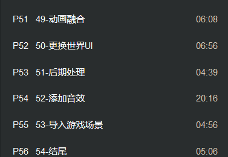

动画的融合 键盘布局下 enter左边的键可以看到AI的特性(小键盘1~3可以看到效果)

人物在运动的时候受到伤害 上半身受到伤害蒙太奇 下半身在跑蒙太奇

攻击动画是不会融合的

蒙太奇中添加新的插槽UpperBody

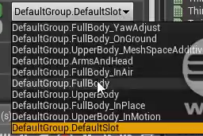

输入ca 存储当前姿势

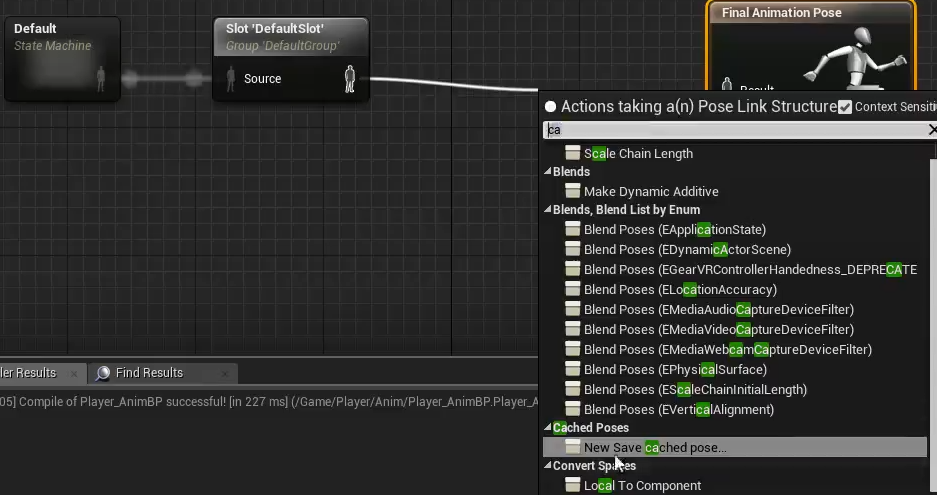

使用当前的存储动画 并且继续存储

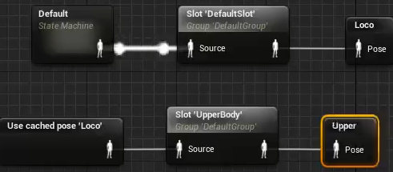

上是基本姿势 下是融合姿势

骨骼融合 Layered blend per bone 上基础姿势 下混合姿势

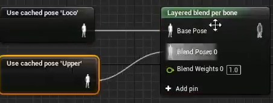

混合脊柱(在Mesh中获取名字)

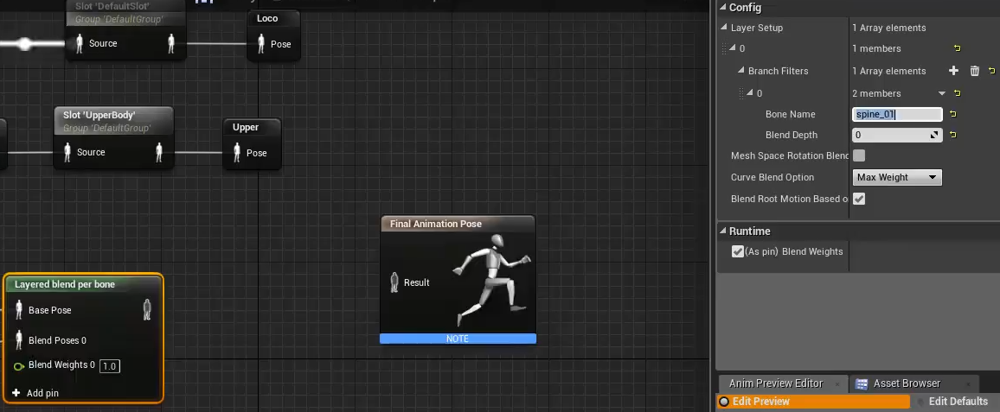

混合旋转(是否) 没勾则会蒙太奇什么方向就什么方向 勾了之后会进行融合 (因此打勾)

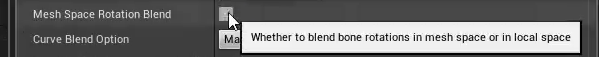

若静止则不需要融合 若正在移动 则进行融合

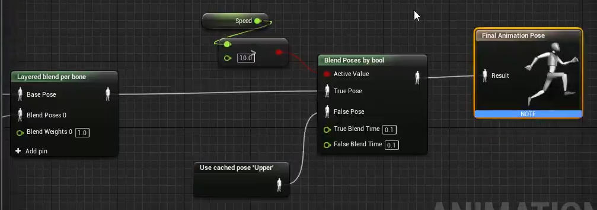

更改世界UI 世界坐标的UI

全屏幕改为自定义 

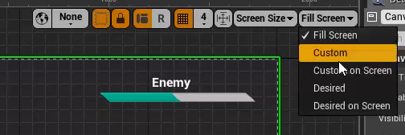

弃用原本的方法

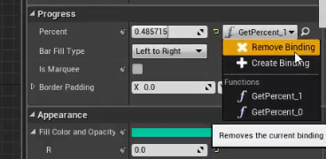

设为外界可以访问的值

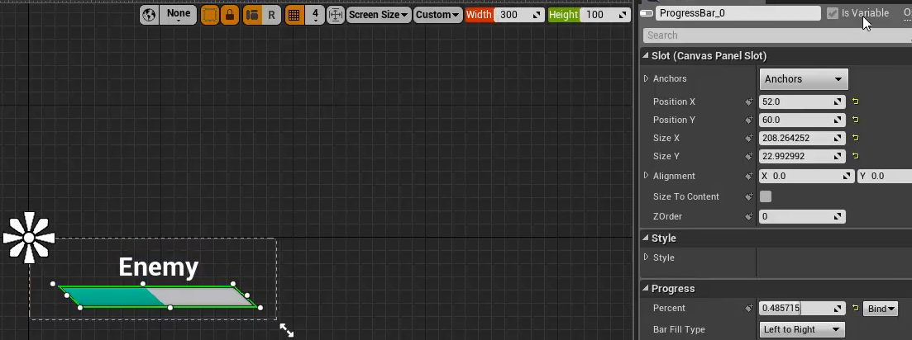

将Init中两个蓝色显示节点删除

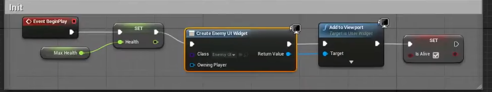

写入新的函数 Update Widget

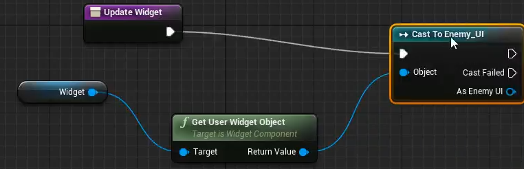

修订Enemy血条 动态修改

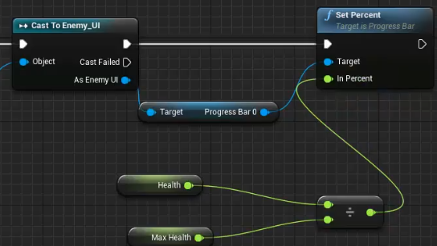

Init中调用方法

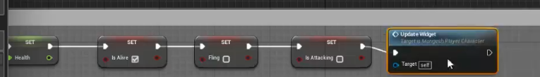

在每次计算Damage后受伤 调用此方法更新血条

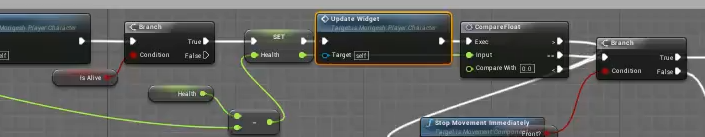

后期处理 视觉效果->后期处理盒子 颜色色彩的后期处理

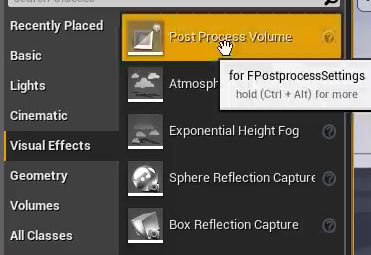

场景颜色设定 在盒子才有颜色效果

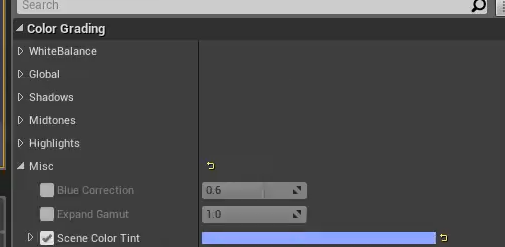

勾选 全局是海(上一个是否开启) 上上一个渐变混合范围 第一个是优先级多个场景盒子颜色色调 后期盒子多个的优先级

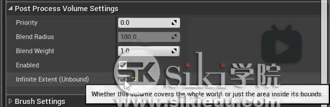

动态模糊设定 可以缓和此时的运动模糊的情况

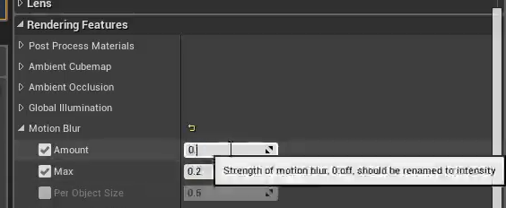

添加音效 在动画蒙太奇中(类似通知)

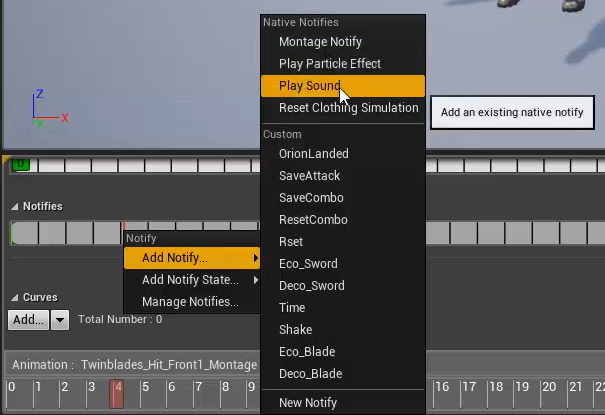

紫色底 一个声音 蓝色底 可以多种声音(wav格式)

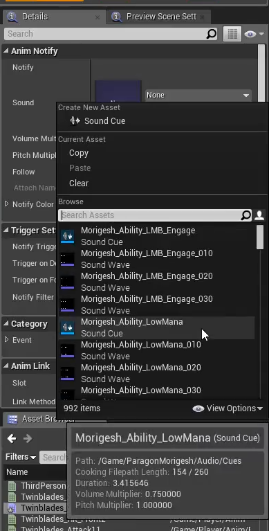

随机播放声音

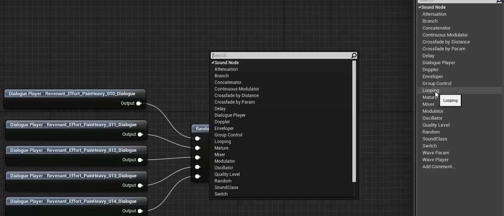

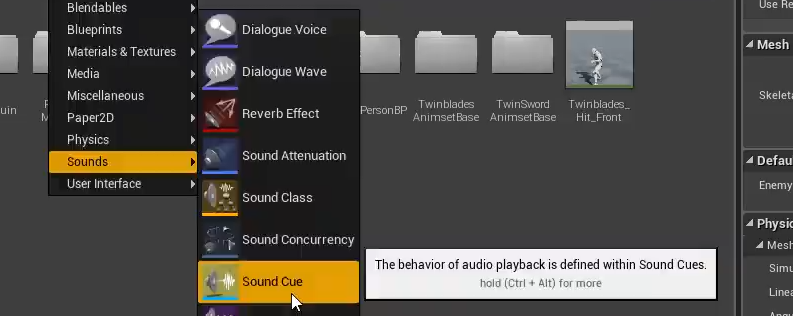

设定消失销毁

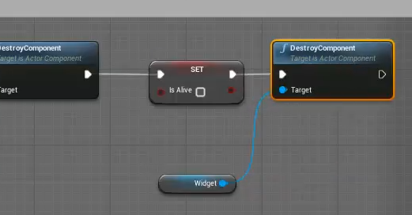

导入游戏场景 

后期处理盒子 

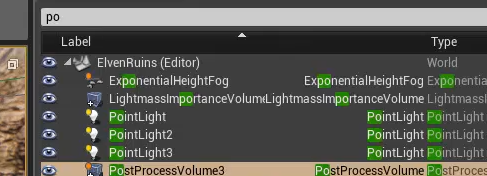

还原此属性

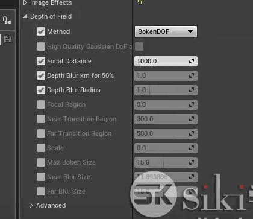

