换装系统笔记

GameMode 场景的游戏模式

Actor 放置世界中的物体 不会被操控（比如子弹
Pawn 继承自Actor 多一些功能 有操控 相应外部输入能力 与场景可以交互
Character 人形Pawn

PlayerController 逻辑 控制器（玩家的意愿 游戏逻辑 动的能力）智能决策（动）
Pawn 固有行为逻辑 前进后退 播放动画 碰撞检测 （能）
例如：A、B炮车都是Character PlayerController用于追踪蓝图等 Pawn写入不同的攻击（开炮）方式

capsule collision 胶囊体碰撞盒
skeletal mesh 骨骼网格体
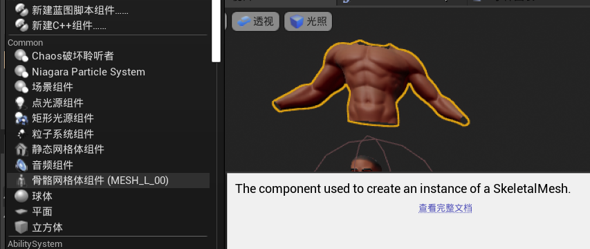

Set Master Pose Component 设置总姿势组件
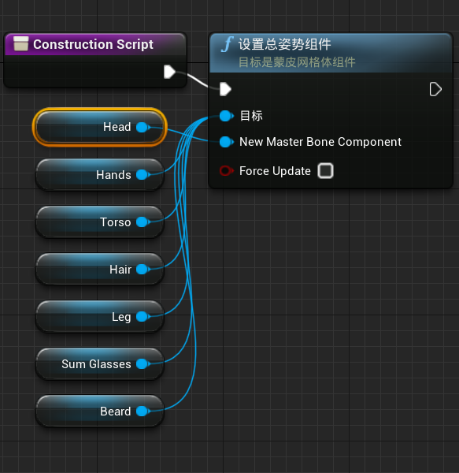

CustomEvent....自定义事件

Skeletal Mesh 骨骼网络体

更换传入的mesh
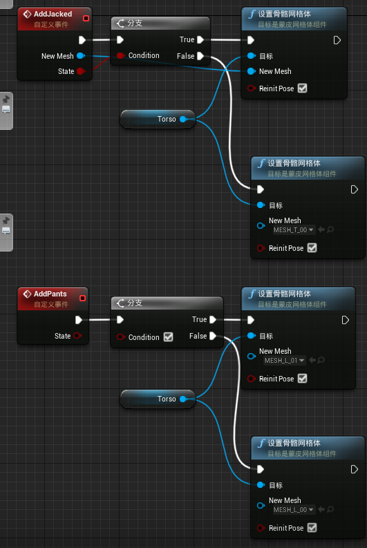
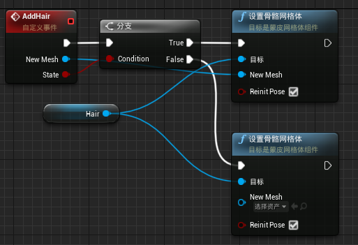
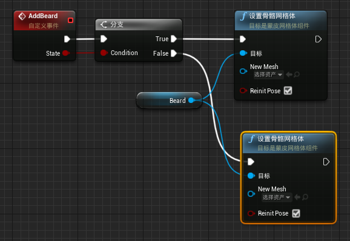
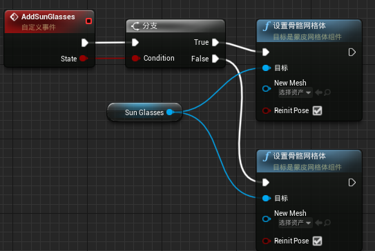

Set members in ()名字  设置(名字)中的成员

存储数据蓝图(关卡切换时 保存数据)
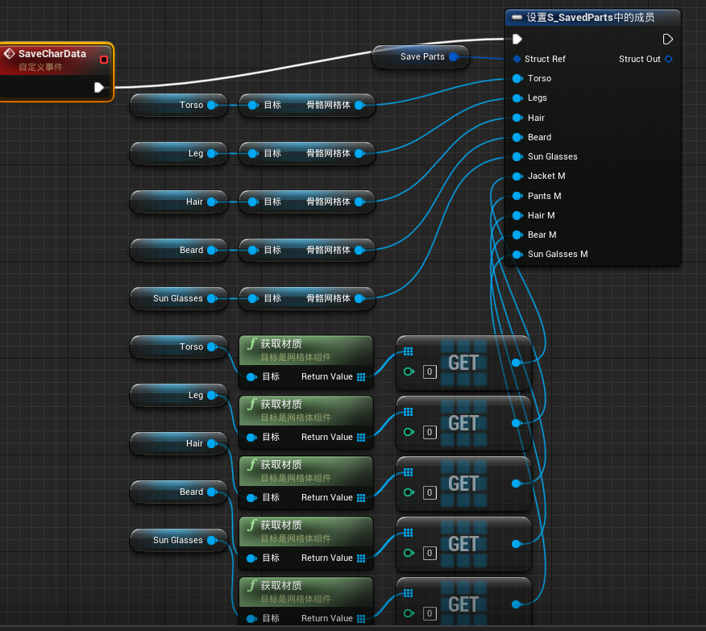

蓝图类GameInstance(存储数据类)
进入游戏后 该类将会被创建 且只创建一个 不管怎么切换关卡 一直存在的对象

事件图表传入数据
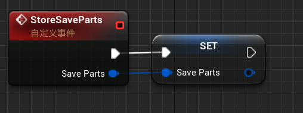

定义函数传出数据
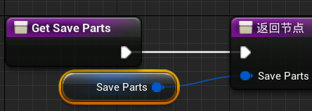

事件开始运行 强转GameInstance数据
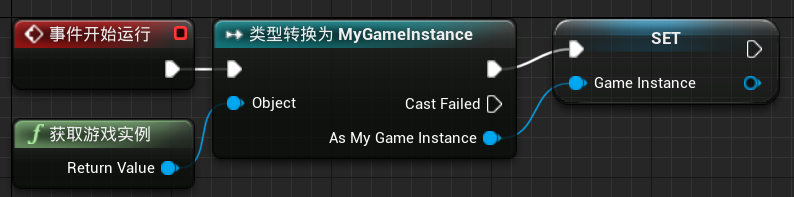

NewWidgetBlueprint UI界面定义

create widget 构建None 创建控件
add to viewport 添加到视口
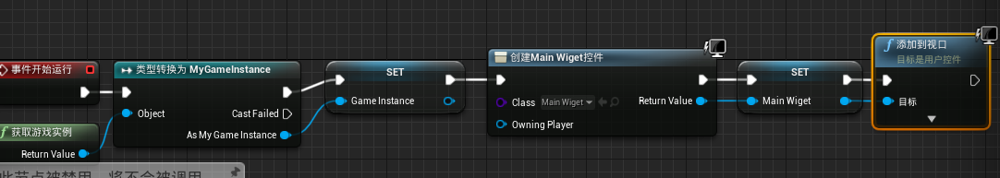

set input mode UI only 设置仅输入模式UI（只允许UI输入
show mouse cursor 显示鼠标光标
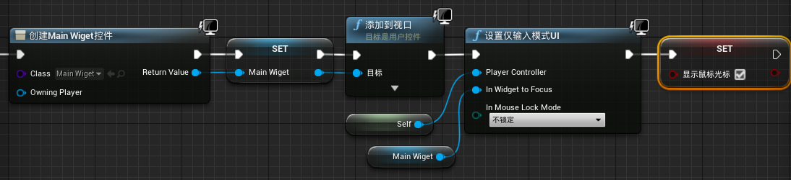
返回Actor
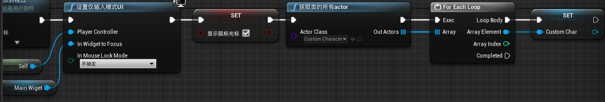

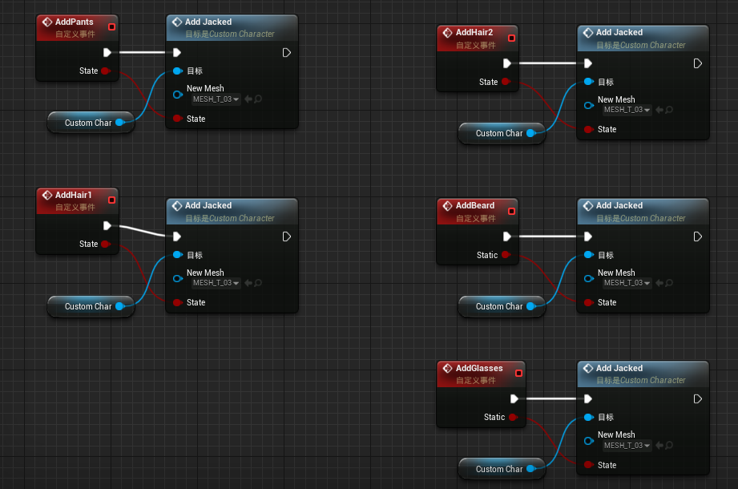

get owning player 获取拥有的玩家
获取数据
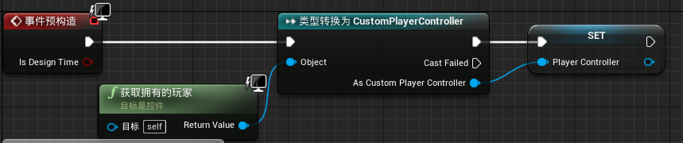

Flip Flop A/B间断返回
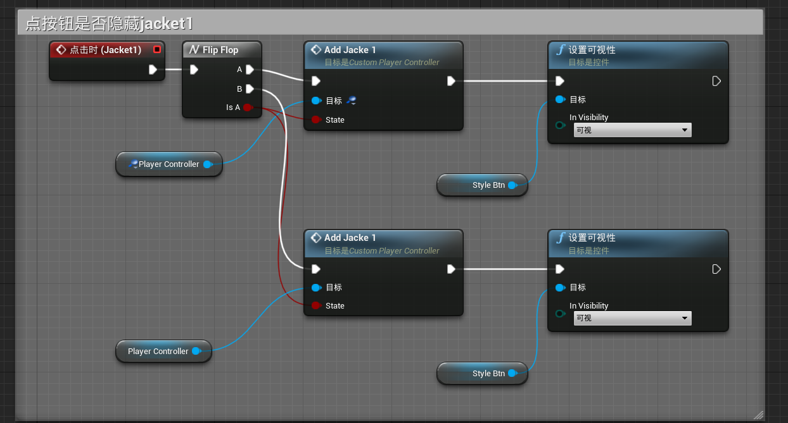

设定枚举值
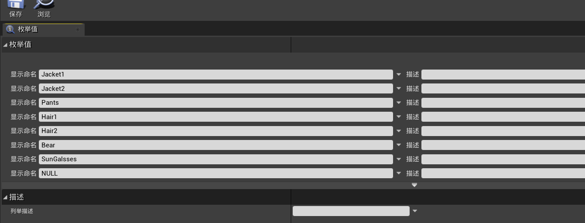

同理设定
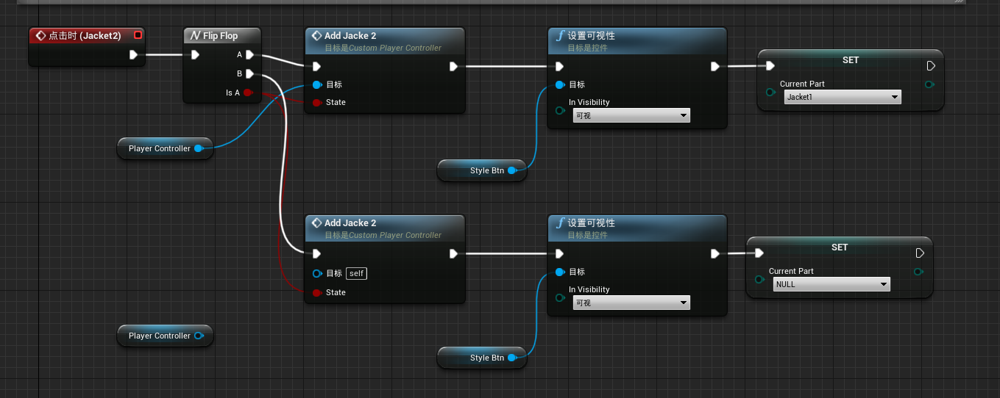

之前蓝图自定义事件勘误补正
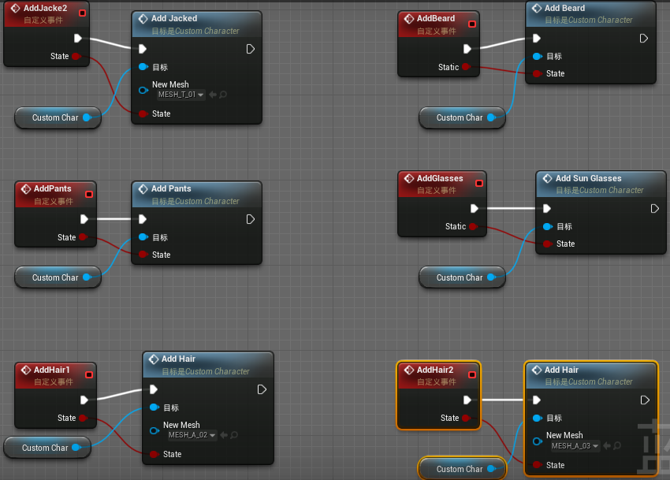

compare int 比较当前int
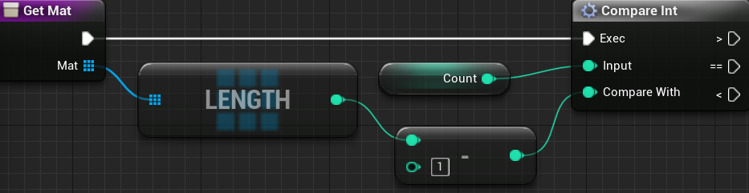

切换材质
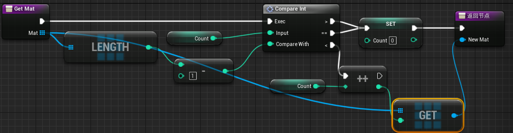

选定启用
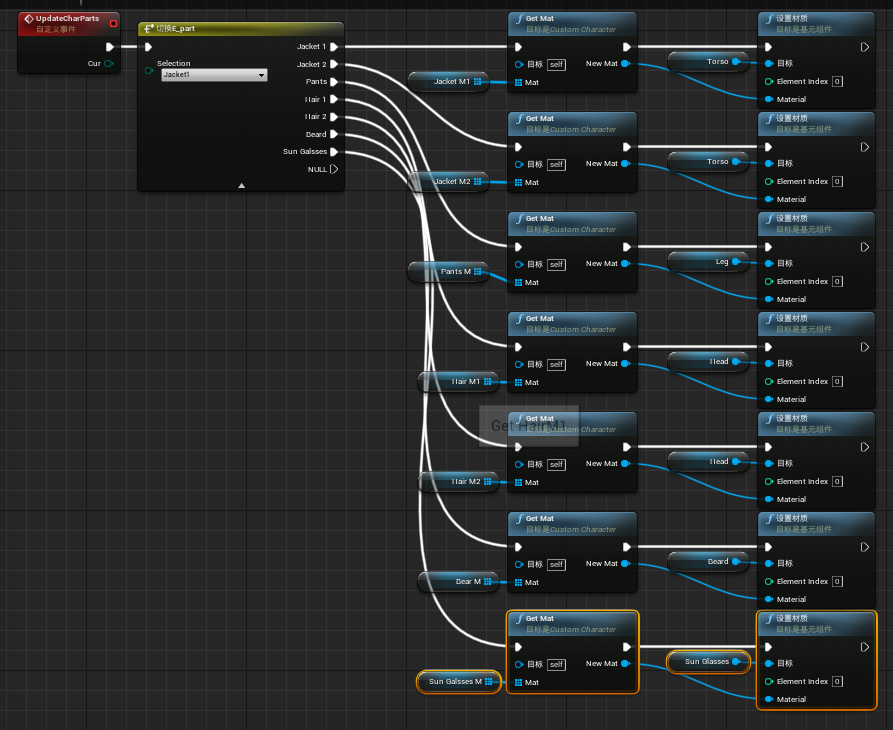

controller 控制更新外观
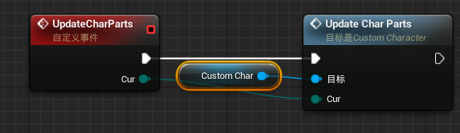

保存更新内容
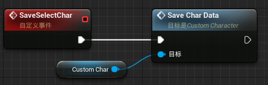

关卡跳转（？）
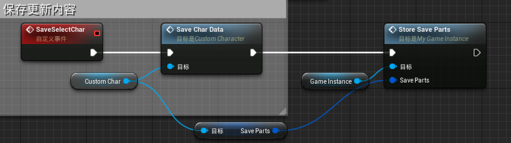

按钮切换服装的材质
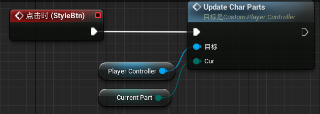

开始游戏 更新关卡
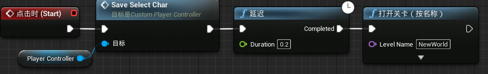

bug修正后的蓝图
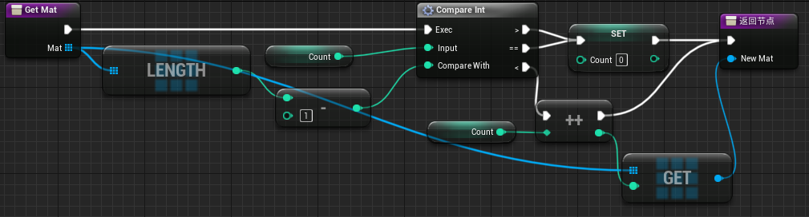