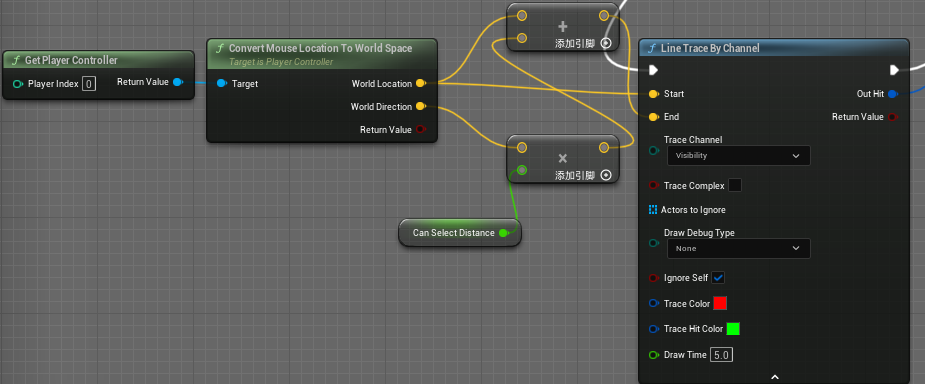

激活射线用以检测(可展示检测射线,注意要设定好具体长度)

[!]目前未曾寻找可以修改射线粗细的地方(等待解决)

射线检测方案:
1.以摄像机中心为方案进行射线检测

2.以鼠标点击为方案进行射线检测

更多资料
https://docs.unrealengine.com/5.0/zh-CN/using-a-single-line-trace-raycast-by-channel-in-unreal-engine/