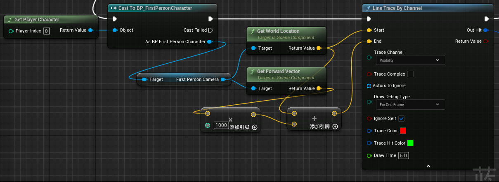
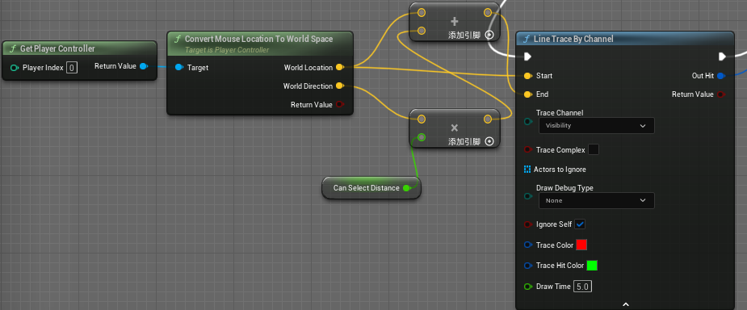

<details>
<summary>ADD</summary>
<pre><code>
添加(对于set/array/map)节点
</code></pre>
</details>


<details>
<summary>AI Move To</summary>
<pre><code>
AI移动至...
</code></pre>
</details>


<details>
<summary>Activate</summary>
<pre><code>
使Effect特效启用(激活组件)

```cpp
// C:\Program Files\Epic Games\UE_5.2\Engine\Source\Runtime\Engine\Private\Components\ActorComponent.cpp
void UActorComponent::Activate(bool bReset)
{
	if (bReset || ShouldActivate()==true)
	{
		SetComponentTickEnabled(true);
		SetActiveFlag(true);

		OnComponentActivated.Broadcast(this, bReset);
	}
}
```
</code></pre>
</details>


<details>
<summary>Add Component by Class</summary>
<pre><code>
添加组件

Target 目标是 附加蓝图主体, 例如BP_FirstPersonCharacter -> First Person Character Reference
</code></pre>
</details>


<details>
<summary>Add Controller Pitch Input</summary>
<pre><code>
添加Pawn的Pitch输入(Rotate Y轴)
</code></pre>
</details>


<details>
<summary>Add Controller Row Input</summary>
<pre><code>
添加Pawn的Yaw输入(Rotate X轴)
</code></pre>
</details>


<details>
<summary>Add Controller Yaw Input</summary>
<pre><code>
添加Pawn的Yaw输入(Rotate Z轴)
</code></pre>
</details>


<details>
<summary>Add Custom event</summary>
<pre><code>
添加自定义事件
</code></pre>
</details>


<details>
<summary>Add Force</summary>
<pre><code>
持续时间持续调用(物理系统的刚体移动)
</code></pre>
</details>


<details>
<summary>Add Impulse at Location</summary>
<pre><code>
在指定位置生成瞬时爆发(脉冲)
</code></pre>
</details>


<details>
<summary>Add Impulse</summary>
<pre><code>
瞬时爆发调用(一次)
</code></pre>
</details>


<details>
<summary>Add Local Offset</summary>
<pre><code>
添加对指定模型的三维位置偏移(在原有三维位置的基础上增加特定参数的便宜)
</code></pre>
</details>


<details>
<summary>Add Mapping Context</summary>
<pre><code>
增加一个控制点映射上下文

Target 是Enhanced Input(Player COntroller -> Get EnhancedInputLocalPlayerSubsystem)

Mapping Context 是 IMC输入组件

Priority 是 输入映射优先级
</code></pre>
</details>


<details>
<summary>Add Movement Input</summary>
<pre><code>
Pawn 自适应运动

World Direction 是位移向量

Scale Value 是位移向量的大小

Force 如果为True 则固定添加输入 无视IsMoveInputIgnored()的结果
</code></pre>
</details>


<details>
<summary>Add Option</summary>
<pre><code>
添加选项(ComboBox控件)
</code></pre>
</details>


<details>
<summary>Add Radial Force</summary>
<pre><code>
向此组件中的所有实体添加一个力，该力源自提供的世界空间位置。
</code></pre>
</details>


<details>
<summary>Add Spline Mesh Component</summary>
<pre><code>
添加样条组件
</code></pre>
</details>


<details>
<summary>Add Spline Point at Index</summary>
<pre><code>
在索引处添加样条点
</code></pre>
</details>


<details>
<summary>Add Static Mesh Component</summary>
<pre><code>
添加网格体组件
</code></pre>
</details>


<details>
<summary>Add Timeline</summary>
<pre><code>
时间轴(持续输出数轴,可用于动画效果的制作)

Play 有且仅执行一次(下一次不会从头开始)
Play from Start 从头开始执行一次(下一次也是从头开始)
Stop 停止
Reverse 有且仅执行一次逆序
Reverse from End 从尾开始执行一次(下次也是从尾开始)
Set New Time 设置时间轴触发事件
New Time 设置时间轴时长
</code></pre>
</details>


<details>
<summary>Add to Viewport</summary>
<pre><code>
显示选定目标的窗口
</code></pre>
</details>


<details>
<summary>Append</summary>
<pre><code>
1.将多组String[字符串]进行相连后输出

2.将数组附加至另一个数组
</code></pre>
</details>


<details>
<summary>Apply Damage</summary>
<pre><code>
用泛型伤害对指定的Actor造成损伤
</code></pre>
</details>


<details>
<summary>Apply Radius Damage</summary>
<pre><code>
应用半径伤害,由伤害源对静态网格体进行破坏(目标是可破坏组件)
</code></pre>
</details>


<details>
<summary>Apply Resolution Settings</summary>
<pre><code>
应用分辨率设置
</code></pre>
</details>


<details>
<summary>Apply Setting</summary>
<pre><code>
应用设置
</code></pre>
</details>


<details>
<summary>Attach Component to Component</summary>
<pre><code>
将组件附加到组件

目标是组件

parent是目标附加组件规则

Socket Name是附加目标的骨骼插槽名称
</code></pre>
</details>


<details>
<summary>Break Date Time</summary>
<pre><code>
分解"Now"节点In Date Time
</code></pre>
</details>


<details>
<summary>Break Hit Result</summary>
<pre><code>
获取各类射线检测节点后所检测到的对象
</code></pre>
</details>


<details>
<summary>Break [type]</summary>
<pre><code>
将[type]结构体中的数据分解引脚
</code></pre>
</details>


<details>
<summary>Check Component Owner</summary>
<pre><code>
检查组件是否属于指定的Actor(检查组件所有权)
</code></pre>
</details>


<details>
<summary>CLEAR</summary>
<pre><code>
清空
(对于set/array/map)节点
</code></pre>
</details>


<details>
<summary>Cast to [type]</summary>
<pre><code>
强制转换为[type] (注意使用IsValid) ->　转换后可以使用[type]特定的API
</code></pre>
</details>


<details>
<summary>Clear All Mappings</summary>
<pre><code>
清空所有输入上下文
</code></pre>
</details>


<details>
<summary>Clear Spline Points</summary>
<pre><code>
删除Spline组件中所存储的样条点

注:必要性的删除,否则会内存泄漏
</code></pre>
</details>


<details>
<summary>Clear Timer by Function Name</summary>
<pre><code>
清除计时器设置
</code></pre>
</details>


<details>
<summary>Clear and Invalidate Timer by Handle</summary>
<pre><code>
对原有的事件触发的"以事件设置定时器"进行清除和禁用
</code></pre>
</details>


<details>
<summary>Combine Rotators</summary>
<pre><code>
Rotator加运算
</code></pre>
</details>


<details>
<summary>Construct Object from Class</summary>
<pre><code>
创建一个Object实例
</code></pre>
</details>


<details>
<summary>Contains</summary>
<pre><code>
指定字符是否出现在字符串中

Search In 输入字符串
SubString 要搜索的字符串
Use Case 是否区分大小写
Search from End 从头还是从尾开始
</code></pre>
</details>


<details>
<summary>Convert Mouse Location To World Space</summary>
<pre><code>
获取当前鼠标2D位置转换为场景空间2D位置和方向
</code></pre>
</details>


<details>
<summary>Copy Procedural Mesh from Static Mesh Component</summary>
<pre><code>
默认创建碰撞体
</code></pre>
</details>


<details>
<summary>Create Dynamic Material Instance</summary>
<pre><code>
创建一个动态材质实例(参数化材质实例)(注意提升为变量)

注:可以配合Set Vector Parameter Value使用
</code></pre>
</details>


<details>
<summary>Create Save Game Object</summary>
<pre><code>
新建一个空白的SaveGame蓝图对象以设置数据,然后传至SaveGameToSlot
</code></pre>
</details>


<details>
<summary>Create Widget [type]</summary>
<pre><code>
选定资产,创建一个[type]蓝图窗口(不会显示,需要用Add to Viewport节点)

注:建议将返回值(窗口)设定为变量,以便后续使用
</code></pre>
</details>


<details>
<summary>Deactivate</summary>
<pre><code>
使Effect特效失效
</code></pre>
</details>


<details>
<summary>Delay</summary>
<pre><code>
不能够被停止(打断)的延时调用(一次)
与Set Timer by Function Name作区分
与Retriggerable Delay作区分
</code></pre>
</details>


<details>
<summary>Delta(Rotator)</summary>
<pre><code>
Rotator减运算
</code></pre>
</details>


<details>
<summary>Destroy Actor</summary>
<pre><code>
销毁目标Actor
</code></pre>
</details>


<details>
<summary>Destroy Component</summary>
<pre><code>
删除指定组件

当组件自身调用该节点后会移除自身
</code></pre>
</details>


<details>
<summary>Distance Squared(Vector)</summary>
<pre><code>
两点之间的平方举例
</code></pre>
</details>


<details>
<summary>Division</summary>
<pre><code>
对浮点数进行整除(返回商和余数)
</code></pre>
</details>


<details>
<summary>Do N</summary>
<pre><code>
执行N次(可被重置)
</code></pre>
</details>


<details>
<summary>DoOnce</summary>
<pre><code>
触发脉冲一次(reset后可以重新激活执行脉冲一次)
</code></pre>
</details>


<details>
<summary>Does Save Game Exist</summary>
<pre><code>
判断本地有无存档
</code></pre>
</details>


<details>
<summary>Draw Debug Line</summary>
<pre><code>
仅开发测试:构建一条线以供测试
</code></pre>
</details>


<details>
<summary>Draw Line</summary>
<pre><code>
绘制一条二维线
</code></pre>
</details>


<details>
<summary>Enable VisLog Recording</summary>
<pre><code>
启用录制
</code></pre>
</details>


<details>
<summary>Execute Console Command</summary>
<pre><code>
命令行执行自定义事件(类似于ue Editor 的cmd控制台命令)

Debug Camera 打印相机信息

终端命令台
ToggleDebugCamera 打开相机调试
Slomo
obj dump /Path/To.Obj 打印一个对象的所有UPROPERTY
obj refs name=/Path/To/Obj 列出该对象被引用的堆栈
obj gc 强制触发一次垃圾收集

<details>
<summary>ce [事件名]</summary>
<pre><code>
关卡蓝图通信(事件为在关卡蓝图中CustomEvent蓝图的名字)
</code></pre>
</details>

严重性	代码	说明	项目	文件	行	禁止显示状态
错误	LNK1181	无法打开输入文件“..\Intermediate\Build\Win64\x64\UnrealEditor\Development\UnrealEditor.lib”	UPlayer	C:\Users\chru\Desktop\UPlayer\Intermediate\ProjectFiles\LINK	1	


<details>
<summary>Shot</summary>
<pre><code>
游戏内截图,存储到[项目名字]\Saved\Screenshots\WindowsEditor\ScreenShot[图片编号].png
</code></pre>
</details>

<details>
<summary>HighResShot</summary>
<pre><code>
HighResShot 1 - 游戏内截图,存储到[项目名字]\Saved\Screenshots\WindowsEditor\HighresScreenshot[图片编号].png
HighResShot 2048x2048 - 游戏内截图,以分辨率方式
HighResShot filename=PATH (XxY OR Multiplier) CaptureX CaptureY CaptureW CaptureH bMaskUsingCustomDepth bDumpBufferVisualizationTargets bCaptureHDR bDateTimeAsFilename
| 参数                                | 描述                                                                            |
| ----------------------------------- | ------------------------------------------------------------------------------- |
| XxY                                 | 指定截图的尺寸(宽度x高度)                                                       |
| 乘数(Multiplier)                    | 指定截图的值放大截图尺寸                                                        |
| CaptureX CaptureY CaptureW CaptureH | 用整数定义视口要用于截图的区域                                                  |
| bMaskUsingCustomDepth               | 用一个布尔值(0或1)来控制是否要用自定义深度(Custom Depth)缓冲作为捕获的遮罩      |
| bDumpBufferVisualizationTargets     | 用一个布尔值(0或1)来控制是否要将GBuffer中的每一个通道都捕获为一张图片并将其导出 |
| bCaptureHDR                         | 用一个布尔值(0或1)来控制是否要使用.EXR文件格式来捕获HDR图片                     |
</code></pre>
</details>

更多指令内容:https://docs.unrealengine.com/4.27/en-US/TestingAndOptimization/PerformanceAndProfiling/StatCommands/

~键 调用控制台命令 

0，技巧

键盘 ↑键 可以看到之前输入过的指令
控制台指令并不需要打全名，空格+指令 可以模糊搜索
Ctrl + Shift + 逗号 ，打开 GPUProfile 面
1，调试类

stat fps —— 显示帧率
stat unit —— 显示包括Draw Call ，游戏逻辑等各种项的消耗
stat UnitGraph —— 显示各个参数的实时曲线图
stat rhi —— 显示各种GPU上的消耗细则
stat game —— 显示当前帧的时间信息
stat Engine —— 显示帧数时间，三角面数等
stat scenerendering —— 显示Drawcall
ShowFlag.Bounds —— 显示包围盒（0关闭，1打开）
ShowFlag.Collision—— 显示碰撞盒（0关闭，1打开）
r.visualizeOccludedPrimitives —— 查看遮挡剔除（0关闭，1打开）
DisableAllScreenMessages/EnableAllScreenMessages —— 关闭/打开屏幕打印信息
ke * rendertextures 高分辨率截图
HighResShot  —— 以当前viewport分辨率的倍数进行截图（倍数）
HighResShot 3840x2160 —— 指定分辨率截图（分辨率）【图片存储位置：\Saved\Screenshots\】
stat Hitches —— 或者stat DumpHitches 记录log文件
stat startfile / stat stopfile —— 开始/结束统计性能分析  ，用于记录某段时间内的性能分析数据。【此时会在路径 Saved/Profiling/UnrealStats 下生成数据文件。】
2，图像类

r.vsync 0—— 垂直同步（0关闭，1打开）
r.Tonemapper.Sharpen 3 —— 锐化（锐化强度）
r.Streaming.PoolSize 4096 —— 显存多少分配给了纹理流送池（显存大小，0表示无上限）
r.ScreenPercentage 50 —— 设置渲染分辨率为默认大小的50%
r.TonemapperFilm —— 开关后处理效果
ShowFlag.PostProcessing —— 开关后期盒子效果
r.AOSpecularOcclusionMode —— 可以让 skylight 产生的 DFAO 产生更准确的高光（0关闭，1打开）
3，游戏类

slomo —— 游戏运行速度（运行速度）
</code></pre>
</details>


<details>
<summary>Execute Python Command(Advanced)</summary>
<pre><code>
可以指定填入的字符串是代码还是文件，可以拿到命令结果和运行返回值，还可以打Log（毕竟高级）
</code></pre>
</details>


<details>
<summary>Execute Python Command</summary>
<pre><code>
可以运行代码也可以运行文件，系统智能判断是python代码还是文件，文件路径可以是绝对路径也可以是系统路径
</code></pre>
</details>


<details>
<summary>Execute Python Script</summary>
<pre><code>
用来运行Python代码的
</code></pre>
</details>


<details>
<summary>Fceil</summary>
<pre><code>
向上取整(四舍五入)
</code></pre>
</details>


<details>
<summary>Field Of View</summary>
<pre><code>
设置Character摄像机(视口)焦距的距离
</code></pre>
</details>


<details>
<summary>Find Look at Rotation</summary>
<pre><code>
根据两点坐标返回旋转体
</code></pre>
</details>


<details>
<summary>Finish Abort</summary>
<pre><code>
AI的行为树中Tasks->Reset Player节点可展开Receive Abort事件用于放弃行为任务
Finish Abort即完成(退出该行为蓝图)
</code></pre>
</details>


<details>
<summary>Finish Execute</summary>
<pre><code>
AI的行为树中Tasks->ResetPlayer节点可展开ReceiveExecute事件用于新建行为任务
Finish Execute即完成(退出该行为蓝图)

success (是否返回执行成功) -> 很重要的一点,若是没有设定,若是在Sequence(序列)执行的其中一步,则会直接跳过接下来的步骤,后续的序列行为都会跳过
</code></pre>
</details>


<details>
<summary>Flip Flop</summary>
<pre><code>
奇次运行走A节点,偶次运行走B节点.
</code></pre>
</details>


<details>
<summary>Floor</summary>
<pre><code>
向下取整
</code></pre>
</details>


<details>
<summary>Forloop</summary>
<pre><code>
等同标准代码循环,每个索引间触发执行脉冲一次
</code></pre>
</details>


<details>
<summary>Format Text</summary>
<pre><code>
创建Text实例 (文本/字符串的通配符)
</code></pre>
</details>


<details>
<summary>Gate</summary>
<pre><code>
enter(激活事件,取入执行脉冲)
open(开事件,开始持续输出脉冲)
close(关事件,关闭持续输出脉冲)
toggle(对角执行布尔开关,开状态时触发则变成关,反之亦然)

例:
触发open时,不断触发enter,会有exit输出
触发close时,触发enter,不会有任何效果,只有重新触发open时,再触发enter才有效果
</code></pre>
</details>


<details>
<summary>Get Ability System Component</summary>
<pre><code>
获取能力系统组件

GAS中的一个节点
UE的技能系统 ( Gameplay Ability System 简称：GAS ) ，官方是以插件的形式嵌入在UE引擎中；
你完全可以在自己的 UE 项目中用使用自己团队的"祖传"技能系统，但我还是推荐大型项目优先使用 GAS 。
它的优点是：高度灵活、可复用性强；缺点是：过于庞大、不易上手
</code></pre>
</details>


<details>
<summary>Get Absolute Size</summary>
<pre><code>
绝对空间几何体的大小

Widget -> Get Cached Geometry -> Get Absolute Size
</code></pre>
</details>


<details>
<summary>Get Actor Location</summary>
<pre><code>
获取位置
</code></pre>
</details>


<details>
<summary>Get Actor Of Class</summary>
<pre><code>
获取指定类(带返回值)
</code></pre>
</details>


<details>
<summary>Get Actor Scale 3D</summary>
<pre><code>
获取模型缩放
</code></pre>
</details>


<details>
<summary>Get All Actors Of Class with Tag</summary>
<pre><code>
获取存在指定Tag指定类的所有Actor
</code></pre>
</details>


<details>
<summary>Get Anim Instance</summary>
<pre><code>
获取骨架网格体动画蓝图类实例
</code></pre>
</details>


<details>
<summary>Get BlackBoard</summary>
<pre><code>
获取AI蓝图自身的黑板
</code></pre>
</details>


<details>
<summary>Get Blackboard Value as Actor</summary>
<pre><code>
从黑板获取所属Actor对象
</code></pre>
</details>


<details>
<summary>Get Bounding Box</summary>
<pre><code>
获取模型的边界盒
</code></pre>
</details>


<details>
<summary>Get Cached Geometry</summary>
<pre><code>
获取控件信息的结构体

->
Get Local Size 本地控件几何体的大小
Get Absolute Size 绝对空间几何体的大小
Get Local Top Left 本地控件几何体的局部顶部和左侧
</code></pre>
</details>


<details>
<summary>Get Center Of Mass</summary>
<pre><code>
获取模型质心(实际上是枢轴中心默认点,与质量无关)
</code></pre>
</details>


<details>
<summary>Get Component Bounds</summary>
<pre><code>
获取组件的边界
</code></pre>
</details>


<details>
<summary>Get Component by Class</summary>
<pre><code>
获取指定对象中其所对应自身的指定(一个)组件
</code></pre>
</details>


<details>
<summary>Get Controlled Pawn</summary>
<pre><code>
获取此目标控制器控制的Pawn
</code></pre>
</details>


<details>
<summary>Get Controller</summary>
<pre><code>
获取目标蓝图的控制器
</code></pre>
</details>


<details>
<summary>Get Current Level Name</summary>
<pre><code>
获取当前世界的关卡名字
(可以和"Open Level(by Name)"节点进行完美联动 -> 重新加载当前关卡)
</code></pre>
</details>


<details>
<summary>Get Desired Size</summary>
<pre><code>
获取控件大小(二维参数)
</code></pre>
</details>


<details>
<summary>Get Displayer Name</summary>
<pre><code>
输出指定目标在世界大纲中显示的名字
</code></pre>
</details>


<details>
<summary>Get EnhancedInputLocalPlayerSubsystem</summary>
<pre><code>
从玩家控制器获取(本地玩家子系统)

来源是Player Controller

需要配合"Add Mappint Context"使用,添加增强输入IMC上下文(UE5特性)
</code></pre>
</details>


<details>
<summary>Get Game User Settings</summary>
<pre><code>
获取游戏设置
</code></pre>
</details>


<details>
<summary>Get Input Key Time Down</summary>
<pre><code>
返回按下指定的键的时间长度
获取输入按键的时间(长按的话...[?])
</code></pre>
</details>


<details>
<summary>Get Impulse</summary>
<pre><code>
将一个冲凉添加到刚体(单次实时爆发)
</code></pre>
</details>


<details>
<summary>Get Local Size</summary>
<pre><code>
本地控件几何体的大小

Widget -> Get Cached Geometry -> Get Local Size
</code></pre>
</details>


<details>
<summary>Get Local Top Left</summary>
<pre><code>
本地控件几何体的局部顶部和左侧

Widget -> Get Cached Geometry -> Get Local Top Left
</code></pre>
</details>


<details>
<summary>Get Materials</summary>
<pre><code>
获取指定拥有材质对象的材质数组(例如 StaticMeshComponent拥有材质)
</code></pre>
</details>


<details>
<summary>Get Millisecond</summary>
<pre><code>
左链接"Now"后可获取此时的时间(秒)
</code></pre>
</details>


<details>
<summary>Get Mouse X</summary>
<pre><code>
获取鼠标X坐标
</code></pre>
</details>


<details>
<summary>Get Mouse Y</summary>
<pre><code>
获取鼠标Y坐标
</code></pre>
</details>


<details>
<summary>Get Nav Agent Location</summary>
<pre><code>
在导航网格上检索了目标的位置(AI导航网格内的位置[Nav Mesh Bounds Volume])
</code></pre>
</details>


<details>
<summary>Get Num Materials</summary>
<pre><code>
获取指定对象拥有材质的个数(注:使用时记得-1,材质的索引从0开始)
</code></pre>
</details>


<details>
<summary>Get Object Name</summary>
<pre><code>
获取模型在关卡中的UAID((应该具备唯一性))
</code></pre>
</details>


<details>
<summary>Get Overlapping Components</summary>
<pre><code>
获得目标Actor所有的组件对象
</code></pre>
</details>


<details>
<summary>Get Owning Player</summary>
<pre><code>
获取Player拥有者Controller

与GetPlayerController节点的对比

GetOwningPlayervsGetPlayerController对比表
| 对比维度     | GetOwningPlayer                                                       | GetPlayerController                                      |
| ------------ | --------------------------------------------------------------------- | -------------------------------------------------------- |
| 核心功能     | 从当前对象（如Pawn、Actor）的所属关系中获取其拥有者的PlayerController | 通过玩家索引（如Player0）全局获取特定PlayerController    |
| 参数依赖     | 无需参数，依赖当前对象的上下文（如Actor的Owner属性）                  | 需要玩家索引参数（默认0为本地玩家）                      |
| 适用场景     | 对象明确属于某个玩家（如角色、武器、组件）                            | 需要直接访问特定玩家的控制器（如本地玩家、多人游戏分控） |
| 返回值可靠性 | 若对象未被玩家控制（如AI控制），可能返回空值                          | 只要索引有效，始终返回对应控制器                         |
| 典型用例     | -在角色蓝图中获取控制它的玩家控制器<br>-武器获取使用者的输入权限      | -游戏模式中遍历所有玩家<br>-UI绑定本地玩家输入           |
| 依赖关系     | 依赖对象的所有者层级（如Pawn→PlayerController）                       | 依赖全局玩家管理逻辑（与对象无关）                       |
| 多人游戏处理 | 自动适应所属玩家的索引（无需手动指定）                                | 需明确指定玩家索引（如Player0、Player1）                 |
| 潜在问题     | 若对象无有效拥有者，可能返回空值                                      | 索引超出范围时返回空值（如单机游戏中使用Player1）        |

使用场景示例表
| 场景描述                     | 推荐节点              | 原因                                            |
| ---------------------------- | --------------------- | ----------------------------------------------- |
| 角色需要获取自己的控制器     | Get Owning Player     | 直接通过角色所属关系获取，无需知道玩家索引      |
| 游戏模式中遍历所有玩家控制器 | Get Player Controller | 通过循环索引（0到N-1）获取每个玩家的控制器      |
| UI控件绑定本地玩家的输入     | Get Player Controller | 明确使用索引0（本地玩家），不依赖UI控件的拥有者 |
| 武器需要获取使用者的控制器   | Get Owning Player     | 通过武器所属角色链获取控制器                    |

</code></pre>
</details>


<details>
<summary>Get Pivot Offset</summary>
<pre><code>
获取局部枢轴偏移量(注意,蓝图仅在编辑器中使用)
</code></pre>
</details>


<details>
<summary>Get Play Rate</summary>
<pre><code>
获得播放速率
</code></pre>
</details>


<details>
<summary>Get Playback Position</summary>
<pre><code>
获得播放位置
</code></pre>
</details>


<details>
<summary>Get Random Point In Navigable Radius</summary>
<pre><code>
在原点的给定半径中生成一个随机的位置
</code></pre>
</details>


<details>
<summary>Get Screen Resolution</summary>
<pre><code>
获取游戏窗口分辨率
</code></pre>
</details>


<details>
<summary>Get Selected Index</summary>
<pre><code>
获取选项索引(ComboBox控件)
</code></pre>
</details>


<details>
<summary>Get Size</summary>
<pre><code>
获取大小

Widget -> Slot as Canvas Slot -> Get Size
</code></pre>
</details>


<details>
<summary>Get Supported Fullscreen Resolutions</summary>
<pre><code>
获取支持的窗口化全屏分辨率
</code></pre>
</details>


<details>
<summary>Get Surface Type</summary>
<pre><code>
获取表面类型 返回给定命中的 EPhysicalSurface 类型

```cpp
//C:\Program Files\Epic Games\UE_5.2\Engine\Source\Runtime\Engine\Private\GameplayStatics.cpp
// 获取碰撞命中结果的物理表面类型
EPhysicalSurface UGameplayStatics::GetSurfaceType(const struct FHitResult& Hit)
{
	// 从命中结果中获取物理材质
	UPhysicalMaterial* const HitPhysMat = Hit.PhysMaterial.Get();
	// 使用物理材质来确定表面类型
	return UPhysicalMaterial::DetermineSurfaceType( HitPhysMat );
}
```
</code></pre>
</details>


<details>
<summary>Get Time Seconds</summary>
<pre><code>
对时间频率计数
</code></pre>
</details>


<details>
<summary>Get Timeline Length</summary>
<pre><code>
获取时间轴长度(DeltaTime)
</code></pre>
</details>


<details>
<summary>Get Unpaused Time Second</summary>
<pre><code>
获取当前世界经过的时间
</code></pre>
</details>


<details>
<summary>Get World DeltaSeconds</summary>
<pre><code>
返回帧时间差量(秒),由时间膨胀调整
</code></pre>
</details>


<details>
<summary>Get World Transfrom</summary>
<pre><code>
获取转换
</code></pre>
</details>


<details>
<summary>GetRandomReachablePointInRadius</summary>
<pre><code>
随机位置
</code></pre>
</details>


<details>
<summary>Has Mapping Context</summary>
<pre><code>
判断是否存在输入映射

Target 目标是Player Controller -> Enhanced Input Local Player Subsystem

Mapping Context 目标是输入映射


Out Found Priority 设置输入优先级

Return Value 输入映射是否存在
</code></pre>
</details>


<details>
<summary>IS VALID INDEX</summary>
<pre><code>
判断指定索引是否有效
</code></pre>
</details>


<details>
<summary>Inverse Transform Location</summary>
<pre><code>
本地坐标和世界坐标转换
</code></pre>
</details>


<details>
<summary>Is Head Mounted Display Enabled</summary>
<pre><code>
判断是否启用了头戴式显示器
</code></pre>
</details>


<details>
<summary>Is Local Player Controller</summary>
<pre><code>
控制器是否为一个本地控制的玩家控制器
</code></pre>
</details>


<details>
<summary>Is Looping</summary>
<pre><code>
节点返回一个布尔值，如果输入时间轴正在循环则返回True,如果输入时间轴没有循环，则返回False。

参考资料
https://docs.unrealengine.com/4.26/zh-CN/ProgrammingAndScripting/Blueprints/UserGuide/Timelines/TimelineNodes/
</code></pre>
</details>


<details>
<summary>Is Over Focusable Widget</summary>
<pre><code>
WidgetInteraction组件对象引出 可以判断是否与3D UI(Widget 组件)进行了交互
</code></pre>
</details>


<details>
<summary>Is Packaged for Distribution</summary>
<pre><code>
判断此时游戏运行状态是"调试"还是打包后的"运行"模式(开发版本与发布版本作区分)
</code></pre>
</details>


<details>
<summary>Is Playing</summary>
<pre><code>
正在播放判断
</code></pre>
</details>


<details>
<summary>Is Reversing</summary>
<pre><code>
正在反向播放
</code></pre>
</details>


<details>
<summary>Is Simulating Physics</summary>
<pre><code>
设定主体对象的模拟物理(是否处于物理模拟状态)
</code></pre>
</details>


<details>
<summary>Lerp(Rotater)</summary>
<pre><code>
将两旋转体以插值形式返回,A无限接近于朝向B,Shortest Path(打勾)设定最低的旋转点(锐角,最短路)

Shortest Path 以最小转轴角度为准
</code></pre>
</details>


<details>
<summary>Lerp</summary>
<pre><code>
从A到B的插值

alpha设定为具体的插值值
</code></pre>
</details>


<details>
<summary>Line Trace By Channel</summary>
<pre><code>
激活射线用以检测(可展示检测射线,注意要设定好具体长度)

[!]目前未曾寻找可以修改射线粗细的地方(等待解决)

射线检测方案:
1.以摄像机中心为方案进行射线检测


2.以鼠标点击为方案进行射线检测


更多资料
https://docs.unrealengine.com/5.0/zh-CN/using-a-single-line-trace-raycast-by-channel-in-unreal-engine/
</code></pre>
</details>


<details>
<summary>Line Trace For Object</summary>
<pre><code>
沿给定的线执行碰撞追踪并返回追踪命中的首个物体(ObjectType)

更多资料
https://docs.unrealengine.com/5.0/zh-CN/using-a-single-line-trace-raycast-by-object-in-unreal-engine/
</code></pre>
</details>


<details>
<summary>Load Game from Slot</summary>
<pre><code>
加载存档(专属蓝图Save Game)
</code></pre>
</details>


<details>
<summary>Load Level Instance</summary>
<pre><code>
不会销毁当前的World,将另一个Level Instance添加到当前的World
加载过程中World是始终存在的,因此能够同时在Load Level Instance时运行其他Actor
注:可以通过Set is Requesting Unload and Removal 卸载 Level Instance

Load Level Instance 不会销毁当前的 World，而是将另一个 Level Instance 添加到当前的 World 中，
由于加载过程中 World 是始终存在的，因此能够同时在 Load Level Instance 时运行其它 Actor。
可以通过 Set is Requesting Unload and Removal 卸载 Level Instance。
</code></pre>
</details>


<details>
<summary>Load stream Level</summary>
<pre><code>
关卡蓝图中调用 用于预处理缓存地图(以便后续在Active Level方式激活)

Load Stream Level 不会销毁当前 World，而是将 Level 流送到当前的 World 中，Stream Level 需要在 Level 面板中提前设置。
由于加载过程中 World 是始终存在的，因此能够同时在 Load Stream Level 时运行其它 Actor。
可以通过 Unload Stream Level 卸载 Stream Level。可以很方便地在主关卡中获得 Stream Level Actors 的引用。
</code></pre>
</details>


<details>
<summary>Make Literal Name</summary>
<pre><code>
创建一个"Name"类型的变量实例
</code></pre>
</details>


<details>
<summary>Make Literal String</summary>
<pre><code>
创建一个string
</code></pre>
</details>


<details>
<summary>Make Rotation from Axes</summary>
<pre><code>
三维向量转坐标轴(Forward+Right+Up)
</code></pre>
</details>


<details>
<summary>Make [type]</summary>
<pre><code>
构造一个临时变量[type]用于赋值
</code></pre>
</details>


<details>
<summary>Map Range Clamped</summary>
<pre><code>
已设置到映射范围
</code></pre>
</details>


<details>
<summary>Max Walk Speed</summary>
<pre><code>
设置Character移动的最快速度
</code></pre>
</details>


<details>
<summary>Min Of Byte Array</summary>
<pre><code>
返回所有数组条目的最小值与其被找到的索引 若提供的数组为空 返回 数值0与索引-1
</code></pre>
</details>


<details>
<summary>Montage Play</summary>
<pre><code>
播放动画蒙太奇

有停止所有蒙太奇播放的选项,并通知所有蒙太奇的End事件(会取消所有蒙太奇的通知) -> 注:与Play Anim Montage有区别
</code></pre>
</details>


<details>
<summary>Multi Line Trace By Channel</summary>
<pre><code>
将沿给定线条执行碰撞追踪，并返回所有遭遇的命中，直到并包含首次阻挡命中，只返回对指定追踪通道响应的对象。这意味着（实际上讲），如果追踪的开始和结束之间有多个带碰撞的 Actor 或 组件（Component） 与指定追踪通道发生 重叠（Overlap） ，你将接收到所有这些Actor和组件。但如果首次命中 阻挡（Block） 了指定追踪通道，则你只会接收到这一个项目。如果你希望无视追踪通道的重叠或阻挡接收到所有项目，则应使用Multi Line Trace By Object节点

参考文献
https://docs.unrealengine.com/5.0/zh-CN/using-a-multi-line-trace-raycast-by-channel-in-unreal-engine/
</code></pre>
</details>


<details>
<summary>MultiGate</summary>
<pre><code>
类似于Flip Flop激活后,依次执行(激活一次,执行其中一个)
Reset(重置)
IsRandom(随机执行其中一个节点,否则为顺序激活)
Loop(重置循环)
StartIndex(开始时的默认节点)
</code></pre>
</details>


<details>
<summary>Nearly Equal [Type]</summary>
<pre><code>
近相等，如果A约等于B则返回true [type=transform/float]

error tolerance为精度
</code></pre>
</details>


<details>
<summary>Niagara Set [Type] Array</summary>
<pre><code>
设置 Niagara Array数据。

目标是 Niagara 数据接口数组函数库
</code></pre>
</details>


<details>
<summary>Open Level</summary>
<pre><code>
打开指定关卡,会销毁当前的World,加载一个全新的Level作为World
注:加载新关卡时会有空档期,此时会黑屏
Open Level 会销毁当前的 World，加载一个全新的 Level 作为 World。
在这个 销毁-加载 的过程中，会出现一个空档期：原 World 中所有 Actor 都不复存在，而新 World 的 Actor 还没部署就位，无法运行。
此时会造成加载中的黑屏。

若使用Open Level(by Name),可以从Get Current Level Name节点的Return Value中获取

java的游戏项目的话,不可避免会想到我的世界
</code></pre>
</details>


<details>
<summary>Open Source</summary>
<pre><code>
设定Media Player播放对象
</code></pre>
</details>


<details>
<summary>Parse Into Array</summary>
<pre><code>
分割字符串,以Delimter切割为数组
</code></pre>
</details>


<details>
<summary>Pause</summary>
<pre><code>
设定MediaPlayer播放暂停
</code></pre>
</details>


<details>
<summary>Play Anim Montage</summary>
<pre><code>
播放动画蒙太奇

注:与Montage Play有所区别
</code></pre>
</details>


<details>
<summary>Play Animation Reverse</summary>
<pre><code>
播放相对于其当前状态的反向动画
</code></pre>
</details>


<details>
<summary>Play Sound at Location</summary>
<pre><code>
在特定的位置播放声音
</code></pre>
</details>


<details>
<summary>Play To</summary>
<pre><code>
从当前位置播放到请求的位置(后暂停)
</code></pre>
</details>


<details>
<summary>Play from Start</summary>
<pre><code>
从开始处播放
</code></pre>
</details>


<details>
<summary>Play</summary>
<pre><code>
播放(例:播放视频,播放骨骼动画)
looping(循环播放)
</code></pre>
</details>


<details>
<summary>Player</summary>
<pre><code>
设定MediaPlayer视频进行播放
</code></pre>
</details>


<details>
<summary>Predict Projectile Path By ObjectType</summary>
<pre><code>
以起始点和速度自主计算出抛物线位置数组
</code></pre>
</details>


<details>
<summary>Press Pointer Key</summary>
<pre><code>
WeidgetInteraction组件引出后可以以激光射线对3D UI 以按键方式模拟(模拟按键与3D UI交互)
与之对应的是 Release Pointer Key(离开按键效果)
</code></pre>
</details>


<details>
<summary>Project World Location to Widget Position</summary>
<pre><code>
获取玩家的投影世界到屏幕位置
</code></pre>
</details>


<details>
<summary>Quit Game</summary>
<pre><code>
退出游戏/将游戏移到后台(默认玩家0,可设置)
</code></pre>
</details>


<details>
<summary>RESIZE</summary>
<pre><code>
将数组调整为指定大小
</code></pre>
</details>


<details>
<summary>RInterp To</summary>
<pre><code>
平滑旋转到目标
</code></pre>
</details>


<details>
<summary>Random [type]</summary>
<pre><code>
随机生成数值(例:float(浮点),Rotator(旋转体))
</code></pre>
</details>


<details>
<summary>Remove Mapping Context</summary>
<pre><code>
移除输入映射操作

Target 目标是Player Controller -> Enhanced Input Local Player Subsystem

Mapping Context 目标是输入映射组上下文
</code></pre>
</details>


<details>
<summary>Remove from Parent</summary>
<pre><code>
窗口从父类中移除
</code></pre>
</details>


<details>
<summary>Replace Inline</summary>
<pre><code>
替换掉指定字符,返回字符出现的次数
</code></pre>
</details>


<details>
<summary>Replace</summary>
<pre><code>
String文本批量替换
Source String (文本来源)
From (替换目标)
To (替换内容)
Search Case Sensitive (是否区分大小写)
</code></pre>
</details>


<details>
<summary>Reset Orientation and Position</summary>
<pre><code>
(VR)重置朝向,将roll和pitch参量归0
</code></pre>
</details>


<details>
<summary>Retriggerable Delay</summary>
<pre><code>
可重新触发延时时间进行一次操作,倒计时过程中再次调用倒计时时间将重置为设置时间
与Delay作区分
</code></pre>
</details>


<details>
<summary>Reverse from End</summary>
<pre><code>
从结尾处反向播放
</code></pre>
</details>


<details>
<summary>Reverse</summary>
<pre><code>
反向播放
</code></pre>
</details>


<details>
<summary>Rotate Vector Around Axis</summary>
<pre><code>
A点围绕B点转轴(返回三维值)

A点
弧度
转轴
</code></pre>
</details>


<details>
<summary>Rotate Vector</summary>
<pre><code>
A Vector
B Rotator
返回旋转体B所旋转的向量A的结果
注,括号带Quat是四元数版本
</code></pre>
</details>


<details>
<summary>Safe Devide</summary>
<pre><code>
(安全除法),当出现除数为0时，返回0，而不是报错
</code></pre>
</details>


<details>
<summary>Save Game to Slot</summary>
<pre><code>
读取存档(专属蓝图Save Game)
</code></pre>
</details>


<details>
<summary>Select String</summary>
<pre><code>
若PickA为True,返回A的值，否则返回B的值，使用条件运算符实现。
</code></pre>
</details>


<details>
<summary>Select</summary>
<pre><code>
选择Index[可以是bool布尔byte字节int整数enum枚举]决定选择的Option Num[BP Type]
枚举实例化(以bool -> Visibility) 例False:Visible True:Collapsed Index:[索引选择]
</code></pre>
</details>


<details>
<summary>Sequence</summary>
<pre><code>
序列,按照then节点依次顺序单线程完成该节点
</code></pre>
</details>


<details>
<summary>Set Active</summary>
<pre><code>
设置粒子效果组件(Particle System Component)是否激活
</code></pre>
</details>


<details>
<summary>Set Actor Enable Collision</summary>
<pre><code>
是否激活指定Actor对象的物理碰撞效果
</code></pre>
</details>


<details>
<summary>Set Actor Hidden In Game</summary>
<pre><code>
隐藏Actor(物理效果仍然存在在场景中)
</code></pre>
</details>


<details>
<summary>Set Array Elem</summary>
<pre><code>
设置数组元素(矩阵)
</code></pre>
</details>


<details>
<summary>Set Blackboard Value as Object</summary>
<pre><code>
设置AI的黑板中的黑板键(相当于赋值)
</code></pre>
</details>


<details>
<summary>Set Brush</summary>
<pre><code>
设定Widget(image)控件的参数
</code></pre>
</details>


<details>
<summary>Set Collision Enabled</summary>
<pre><code>
设置目标静态网格体是否启用碰撞
</code></pre>
</details>


<details>
<summary>Set Collision Response to Channel</summary>
<pre><code>
对目标模型的碰撞参数进行设定
</code></pre>
</details>


<details>
<summary>Set Desire Size in Viewport</summary>
<pre><code>
设定窗口的显示像素
</code></pre>
</details>


<details>
<summary>Set End Scale</summary>
<pre><code>
添加样条的尾部参数
</code></pre>
</details>


<details>
<summary>Set Focus to Game Viewport</summary>
<pre><code>
设定焦距到视口中
</code></pre>
</details>


<details>
<summary>Set Focus</summary>
<pre><code>
将焦距设定到窗口
</code></pre>
</details>


<details>
<summary>Set Full Screen Mode</summary>
<pre><code>
设置游戏窗口级别(fullscreen(全屏) / windowed fullcreen(窗口化全屏)两种模式 / windowed(窗口化)模式)
</code></pre>
</details>


<details>
<summary>Set Game Paused</summary>
<pre><code>
让游戏暂停/开始(联机可能会有问题[?])
</code></pre>
</details>


<details>
<summary>Set Global Time Dilation</summary>
<pre><code>
设置时间膨胀(类似放缓时间速度)
</code></pre>
</details>


<details>
<summary>Set Hidden in Game</summary>
<pre><code>
New Hidden 是否隐藏
Propagate to Children 是否传递给子元素
将模型在游戏中隐藏
</code></pre>
</details>


<details>
<summary>Set Input Mode Game And UI</summary>
<pre><code>
既能控制游戏界面又能控制UI界面
</code></pre>
</details>


<details>
<summary>Set Input Mode Game Only</summary>
<pre><code>
只能控制游戏界面,就是控制当前视角旋转的模式

flush input 功能主要用于清空输入缓冲区，确保实时输入被立即处理。这在某些情况下，例如从脚本或其他延迟更新的场景中，确保输入事件能够被立即处理，从而使 UI 操作更加流畅

在蓝图中使用 flush input 时，它会立即触发所有等待处理的输入事件，而不需要等待下一轮输入处理周期。这有助于确保输入事件被及时处理，从而提高 UI 操作的响应速度和性能

需要注意的是，flush input 应在需要确保输入及时处理的场景中使用，过度使用可能导致输入事件被频繁触发，从而影响性能。

在大多数情况下，让蓝图自然处理输入事件会更加高效。只有在特定场景下，如从脚本中调用 UI 操作时，使用 flush input 才能确保输入事件被立即处理
</code></pre>
</details>


<details>
<summary>Set Input Mode UI Only</summary>
<pre><code>
只能控制UI界面(游戏界面定在那不动)
兴许与Set Game Paused 相关
</code></pre>
</details>


<details>
<summary>Set Intensity</summary>
<pre><code>
设置强度(光源)
</code></pre>
</details>


<details>
<summary>Set Light Color</summary>
<pre><code>
设置灯光颜色
</code></pre>
</details>


<details>
<summary>Set Looping</summary>
<pre><code>
设置循环
设定MediaPlayer 对象进行循环播放
</code></pre>
</details>


<details>
<summary>Set Material</summary>
<pre><code>
设定目标指定索引的指定材质
</code></pre>
</details>


<details>
<summary>Set Mobility</summary>
<pre><code>
设置指定组件(例如StaticMeshComponent)的可移动性(静态/固定/可移动)
</code></pre>
</details>


<details>
<summary>Set Motion Controller Reference</summary>
<pre><code>
运动控制器组件设置
</code></pre>
</details>


<details>
<summary>Set New Time</summary>
<pre><code>
设置新时间
</code></pre>
</details>


<details>
<summary>Set Niagara Variable [Type]</summary>
<pre><code>
设置Niagara 特效可变的参数
</code></pre>
</details>


<details>
<summary>Set Overal Scalability Level</summary>
<pre><code>
设置游戏的总体可扩展性级别
</code></pre>
</details>


<details>
<summary>Set Play Rate</summary>
<pre><code>
设置播放速率
</code></pre>
</details>


<details>
<summary>Set Playback Position</summary>
<pre><code>
设置Sequencer的播放位置
</code></pre>
</details>


<details>
<summary>Set Position in Viewport</summary>
<pre><code>
设置目标窗口的显示位置(可能与锚点有关哦)
</code></pre>
</details>


<details>
<summary>Set Relative Scale 3D</summary>
<pre><code>
设置窗口的3D大小

(可以由此用时间表的方式来制作出淡入淡出的动画效果)
</code></pre>
</details>


<details>
<summary>Set Renderer Custom Depth</summary>
<pre><code>
设定在PostProcessVolume(后期处理盒子)中的指定对象进行(是否)后期处理
(例如在后期盒子中设定高亮材质)
</code></pre>
</details>


<details>
<summary>Set Screen Resolution</summary>
<pre><code>
设置游戏窗口分辨率
</code></pre>
</details>


<details>
<summary>Set Simulate Physics</summary>
<pre><code>
目标静态模型设置物理效果模拟

Simulate为false时暂不启用物理效果模拟
</code></pre>
</details>


<details>
<summary>Set Start Scale</summary>
<pre><code>
添加样条的起始缩放参数
</code></pre>
</details>


<details>
<summary>Set Start and End</summary>
<pre><code>
设定样条的起点终点的位置以及切线
</code></pre>
</details>


<details>
<summary>Set Static Mesh</summary>
<pre><code>
可以将网格体暴露出返回值节点（记得“我的蓝图”中点亮变量的可视化“眼睛”）
</code></pre>
</details>


<details>
<summary>Set Texture Parameter Value</summary>
<pre><code>
改变材质中某个参数的值
</code></pre>
</details>


<details>
<summary>Set Tick Behavior</summary>
<pre><code>
设置Tick行为,目标是Niagara例子系统
</code></pre>
</details>


<details>
<summary>Set Tick Mode</summary>
<pre><code>
对指定蓝图禁用tick
</code></pre>
</details>


<details>
<summary>Set Timeline Length Mode</summary>
<pre><code>
设置时间轴长度模式
</code></pre>
</details>


<details>
<summary>Set Timeline Length</summary>
<pre><code>
设置时间轴长度
</code></pre>
</details>


<details>
<summary>Set Timer by Event</summary>
<pre><code>
以Time的时间间隔来执行事件

-> 以句柄清除定时器并使之无效（清除定时器的实时调用）
</code></pre>
</details>


<details>
<summary>Set Timer by Function Name</summary>
<pre><code>
以函数名设置定时器
设定回调函数 在规定的时间间隔中频繁调用一个方法
与Clear Timer by Function Name(来终止)对应
</code></pre>
</details>


<details>
<summary>Set Uniform Integer</summary>
<pre><code>
设置独立于采样位置的统一整数值
</code></pre>
</details>


<details>
<summary>Set Value as [type]</summary>
<pre><code>
设置AI的黑板中的黑板键(相当于赋值)[type:Bool/Object/Vector]

Key Name 可以使用 Make Literal Name构建
</code></pre>
</details>


<details>
<summary>Set Vector Parameter Value</summary>
<pre><code>
按材质的参数名设置值
将指定目标的材质在特定情况下修改成指定的材质(材质可以用Create Dynamic Material Instance创建材质变量来使用)

Parameter Name 是当前所选创建的材质变量中,材质蓝图中的某个节点参数对象
Value 是传入的值对Material变量中的Parameter Name的值进行修改(替换[?])
</code></pre>
</details>


<details>
<summary>Set View Target with Blend</summary>
<pre><code>
摄像机系统控制回归(使用Sequencer Camera系统后回归操作映射)
</code></pre>
</details>


<details>
<summary>Set Visibility</summary>
<pre><code>
New Visibility 是否可视
Propagate to Children 是否传递给子元素
设置目标可视性(是否显示)
</code></pre>
</details>


<details>
<summary>Set Widget Interaction References</summary>
<pre><code>
设置窗口交互引用

注:初学者VR包中有出现过
</code></pre>
</details>


<details>
<summary>Set [type] Structure (by ref)</summary>
<pre><code>
将指定[type]的对象进行赋值设置值
</code></pre>
</details>


<details>
<summary>Set members in [type]</summary>
<pre><code>
将[type]变量分割结构取值
</code></pre>
</details>


<details>
<summary>Slice Procedural Mesh</summary>
<pre><code>
传入点和法线,将静态网格提进行切割(可设置切割后的网格体保留以及切面材质)
程序化组件类(ProceduralMeshComponent)
</code></pre>
</details>


<details>
<summary>Slot as Canvas Slot</summary>
<pre><code>
将子控件上的槽对象作为画布槽来进行获取,以便操纵布局信息

->
Get Size 获取大小

->
Set Position 设置未知
</code></pre>
</details>


<details>
<summary>Spawn AIFrom Class</summary>
<pre><code>
生成AI类对象
</code></pre>
</details>


<details>
<summary>Spawn Actor</summary>
<pre><code>
在指定位置中生成/销毁某Actor(类似于构造)

当生成的Actor中的变量在右侧细节面板中设定"Instance Editable(可编辑实例)"和"Expose on Spawn(生成时公开)"后,可在该节点上预设Actor的属性
</code></pre>
</details>


<details>
<summary>Spawn Emitter at Location</summary>
<pre><code>
在位置处生成发射器(在给定位置播放指定效果(发射器),完成后对象将消失)
例:生成爆炸特效
</code></pre>
</details>


<details>
<summary>Spawn Sound 2D</summary>
<pre><code>
音效2D播放和停止
</code></pre>
</details>


<details>
<summary>Spawn System at Location</summary>
<pre><code>
在指定位置生成system(niagara system)
</code></pre>
</details>


<details>
<summary>Sphere Trace By Channel</summary>
<pre><code>
球形检测
初始点到七点画一条线,每个点都绘制一个球体,对球体与碰撞物进行判断
注意设置球体弧度

[!]对ObjectTypes需要默认初始化(make array可以解决),目前未知具体用法
</code></pre>
</details>


<details>
<summary>Sphere Trace For Objects</summary>
<pre><code>
球型检测,返回遇到的第一个命中物体,查找属于ObjectType指定类型的对象
</code></pre>
</details>


<details>
<summary>Stop</summary>
<pre><code>
暂停(例:暂停视频,暂停骨骼动画)
</code></pre>
</details>


<details>
<summary>Suggest Projectile Velocity Custom Arc</summary>
<pre><code>
在建议发射物弧形的基础上有碰撞检测的可设定性扩展
</code></pre>
</details>


<details>
<summary>Suggest Projectile Velocity</summary>
<pre><code>
根据起始位置与终点位置来计算抛射物速度参数
</code></pre>
</details>


<details>
<summary>TO ARRAY</summary>
<pre><code>
将set用数组形式表达出来(用于遍历)
</code></pre>
</details>


<details>
<summary>Time Seconds to String</summary>
<pre><code>
将计数时间转换为字符串
</code></pre>
</details>


<details>
<summary>To Lower</summary>
<pre><code>
字符串小写处理
</code></pre>
</details>


<details>
<summary>To Upper</summary>
<pre><code>
字符串大写处理
</code></pre>
</details>


<details>
<summary>ToText[type]</summary>
<pre><code>
To Text [type] 转为text (type:Boolean/Byte/Float/Integer/Integer64/LinearColor/Name/Object/Rotator/String/Transform/Vector/Vector2d)

以float为例
Value -> 输入值
RoundingMode
Always Sign
Use Grouping
Minimum Integral Digits -> 小食店前保留最小位数
Maximum Integral Digits -> 小食店前保留最大位数
Minimum Fractional Digits -> 小数点后的最小位数
Maximum Fractional Digits -> 小数点后的最大位数
</code></pre>
</details>


<details>
<summary>Trace</summary>
<pre><code>
射线追踪、检测
注：需要设定物体碰撞组件的阻挡等设置效果预设
LineTraceByChannel 通过Channel进行查询
LinTraceForObjects 通过ObjectType进行查询
-> out hit 节点以 终端命中结果（Break Hit Result）来获取返回数据
</code></pre>
</details>


<details>
<summary>Transform Direction</summary>
<pre><code>
提供的变换变换方向向量 - 不会改变其长度
</code></pre>
</details>


<details>
<summary>Trim Trailing</summary>
<pre><code>
删除尾部空白字符
</code></pre>
</details>


<details>
<summary>Trim</summary>
<pre><code>
删除前面空白字符
</code></pre>
</details>


<details>
<summary>Truncate</summary>
<pre><code>
将A向0舍入(向上截断)
</code></pre>
</details>


<details>
<summary>WhileLoop</summary>
<pre><code>
当...(条件)的循环
</code></pre>
</details>


