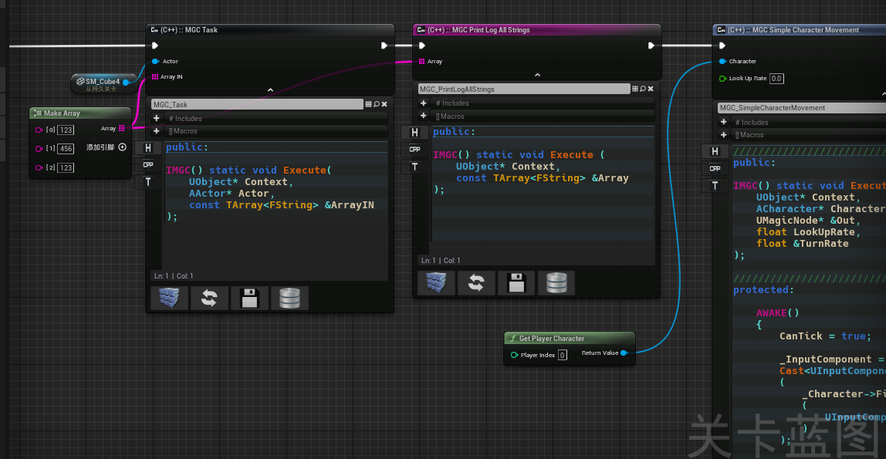

### MagicNodeTask

基于5.2.1创建的魔术节点样例 (Based on the Magic Node example created in 5.2.1)

#### 环境(Environment)

UE 5.2.1 

Visual Studio 2022

Plugins: [Magic Nodes (C++) ]([BrUnOXaVIeRLeiTE/Unreal-Magic-Nodes: Custom Kismet Node System that enables C++ code to be written on Blueprint Graphs (github.com)](https://github.com/BrUnOXaVIeRLeiTE/Unreal-Magic-Nodes)) [author]([github.com/BrUnOXaVIeRLeiTE/](https://github.com/BrUnOXaVIeRLeiTE/))

#### 功能描述(Function Description)

在蓝图中可编译c++代码(c++ code can be compiled in the blueprint)

不赘述,[笔者笔记(~~可能~~持续更新)(Notes)]([Unreal_Engine_Develop_Notes/content/UE/UEplugins/MagicNode at main · i12cu84/Unreal_Engine_Develop_Notes (github.com)](https://github.com/i12cu84/Unreal_Engine_Develop_Notes/tree/main/content/UE/UEplugins/MagicNode))

#### 功能展示(Function display)

注:代码在关卡蓝图中

Note: The code is in the level blueprint

