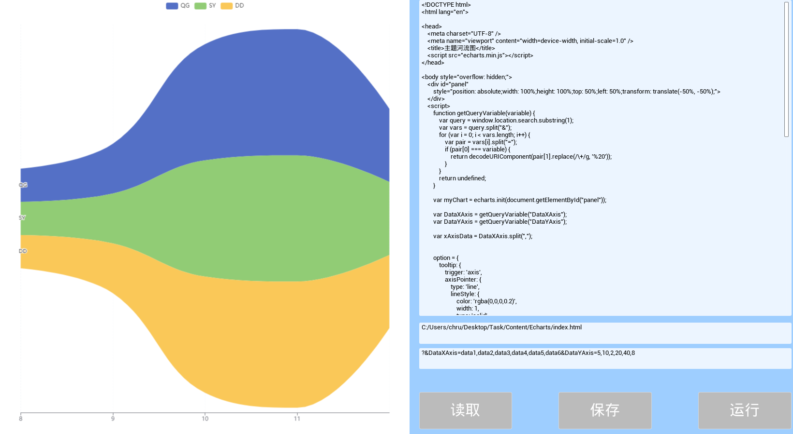

### UWebCompiler

基于5.2.1制作的虚幻 Web Script (Unreal Web Script made based on 5.2.1)

#### 环境(Environment)

UE 5.2.1

Plugins: Web Browser / Echarts(js)

#### 功能描述(Function Description)

左侧为显示Web内容

(下文以A码指代)右侧第一个输入框为JavaScript代码(样例)

(下文以B码指代)右侧第二个输入框为代码路径

(下文以C码指代)右侧第三个输入框为加载附加信息

右下角"读取":读取B码路径的代码并覆盖到A码中,并且运行左侧展示

右下角"保存":将A码保存到B码的路径

右下角"运行":运行代码

注:三个输入框发生改变1s会自运行,当A码更改后会实时改动Eharts/temp.html代码,仅点保存后会覆盖B码路径的文件

On the left is the display of Web content

The first input box on the right is the JavaScript code (example).

The second input box on the right is the code path

The third input box on the right is to load additional information

Bottom right "Read ": Read the code of the B code path and overlay it into the A code, and run the left display

Bottom right corner "Save ": the path to save A code to B code

Bottom right "Run ": Runs the code

Note: When the three input boxes are changed, they will run for 1s. When the A code is changed, the Eharts/temp.html code will be changed in real time, and the file of the B code path will be overwritten after clicking Save

#### 功能展示(Function display)

注意,为了笔记精简,当前路径下的项目缺少了FileOperations插件,请自行[下载并添加](https://github.com/i12cu84/Blueprint-Function-Libraries-from-mine)

[完整工程下载](https://github.com/i12cu84/UWebCompiler)