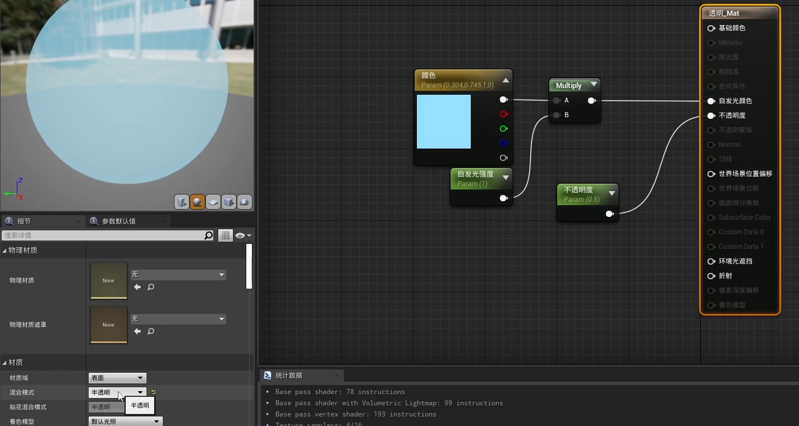
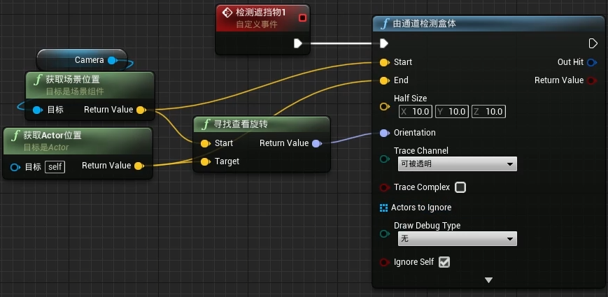
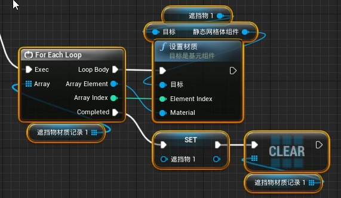
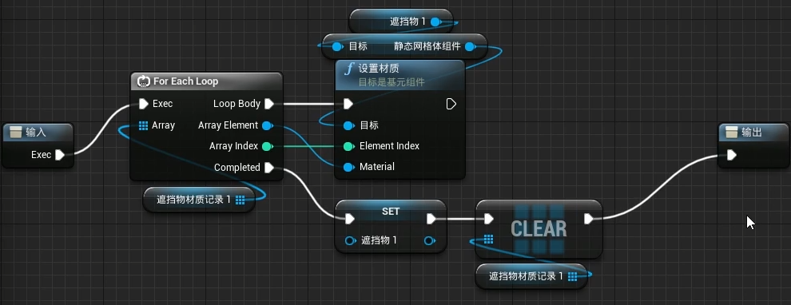
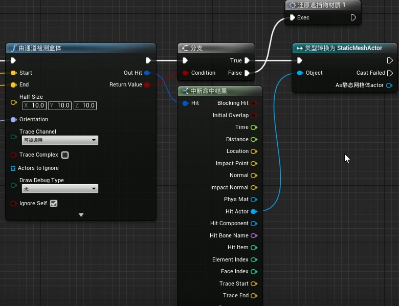
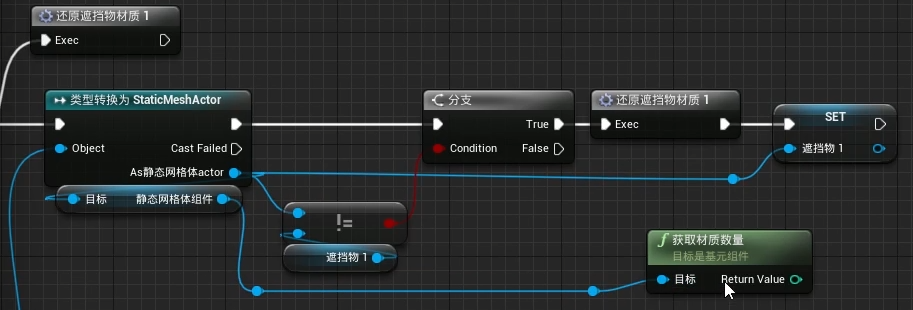
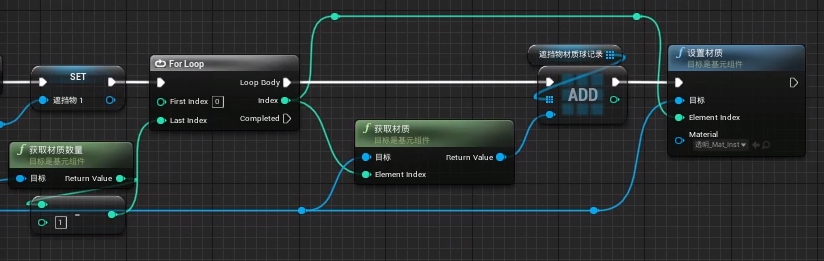
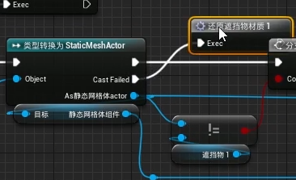
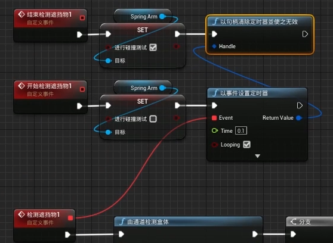
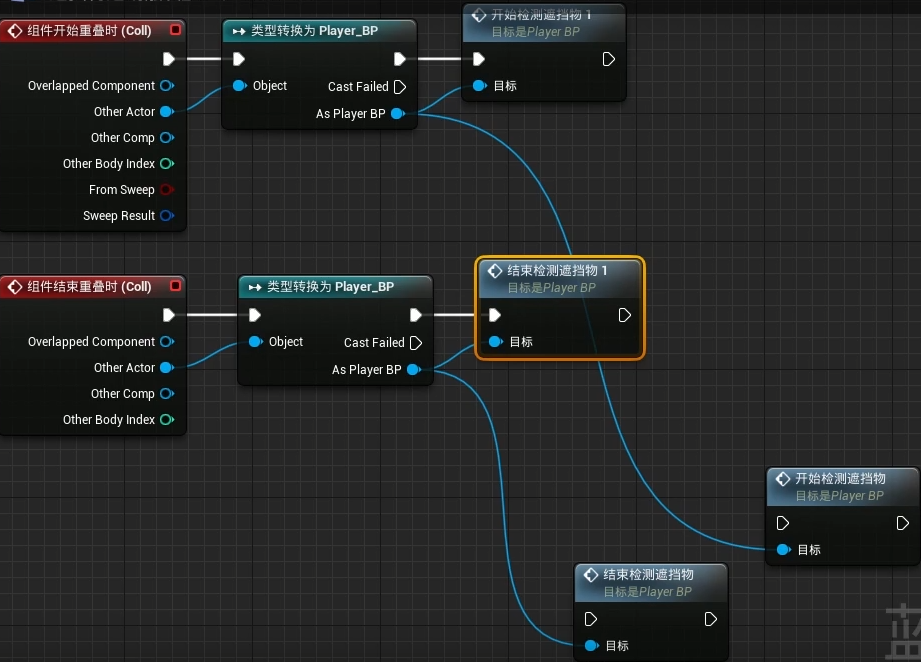

对camera遮挡的物体进行更改素材效果,对character与camera之间的所有物体进行透视化(离开后恢复)

先设定(透明)材质 (类型是 材质接口)

项目设置->引擎->碰撞->可新建检测通道

API封装(还原材质)

->还原遮挡物材质1

加入判断是否为静态网格体(以检测的中断命中结束和类型转换解决)

未遮挡中也添加还原效果

检测遮挡物的情况(开始/结束检测)加入

遮挡物透明触发蓝图

