p1 环境搭建
引擎版本5.1.1 vs2022
OpenXR插件源码来源:https://github.com/mordentral/VRExpansionPlugin
注:[重要]源码分支对应的是ue的版本,需要在vs中编译,
插件官方网站介绍,https://vreue4.com/documentation

项目中启用插件
OpenXR (XR开发规范插件)
Oinline Subsystem Steam(多人联机子系统插件)

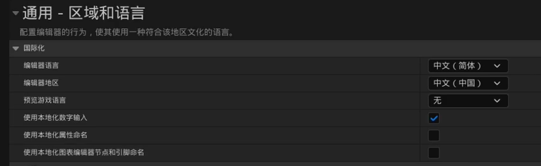
后两项注意关闭(因编码问题,容易崩溃)
Plugin存入OpenXR的插件
创建c++ class 以vs打开进行重新生成解决方案(编译插件)

p2 移动系统
OpenXR有集成专属的VRCharacter(人物蓝图)蓝图类以作相应操作
蓝图中LeftMotionController(左手控制器,可在细节面板中的可视化->Display Device Model 进行观察手势)

输入输出增强映射是ue5的特性(高级输入系统),详情见Input文件夹
输入操作 单触发事件存储触发该事件的按键方案
输入映射情景 集成存储输入操作
玩家可映射输入设置 集成输入映射情景(可多个) 放入OpenXR插件设置(以作场景激活)

OpenXR有集成专属的VRPlayerController(控制器)蓝图以作相应操作
输入系统:
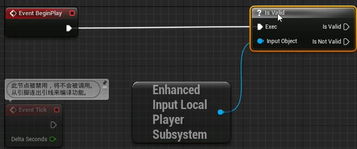
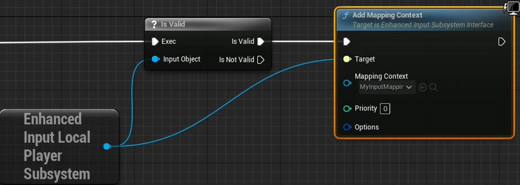

VRC蓝图中以enhanced激活事件触发
移动效果
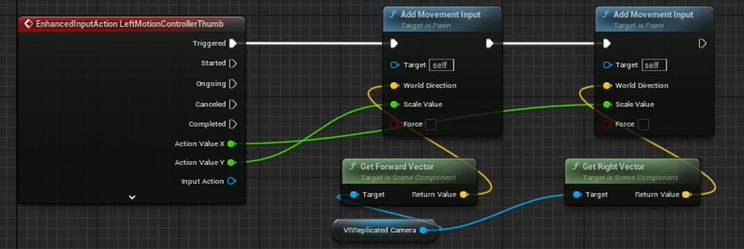

VR Mode 设定好 默认Pawn(VRC) 以及玩家控制器(Controller)
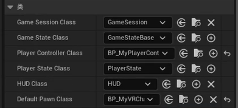

p3 抓取效果
GripObject(获取抓取到的物体对象)(官方文档5.3中有详细介绍不赘述)
OpenXR有集成专属的GrippableStaticMeshActor(静态网格体(可抓取))蓝图以作相应操作
细节面板中的VR Grip一栏可以进行一些需要的配置
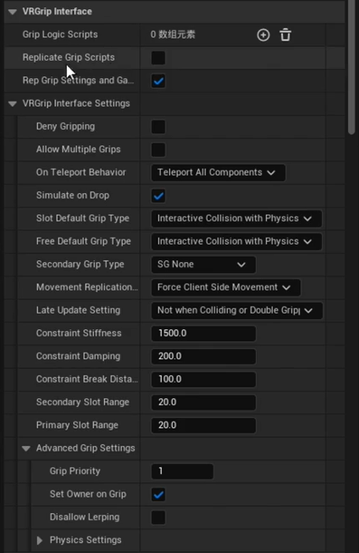
依次是
逻辑脚本
网络同步
(interface setting中)
是否拒绝抓取(抓取无效)
多人允许抓取
丢弃后的模拟物理效果(放下后物体滞空)
插槽抓取(动画快照)
...
抓取优先级
so on

球型检测抓取物体
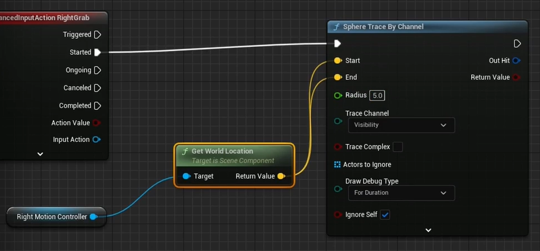
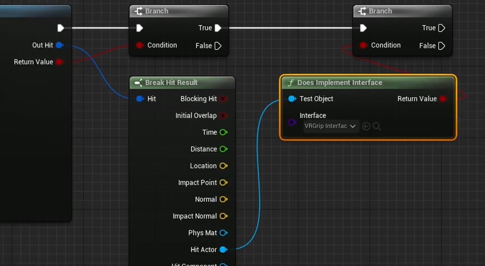
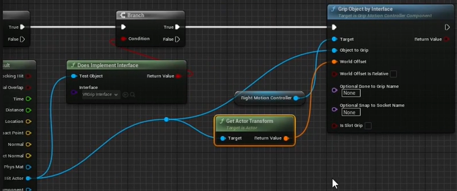
丢弃效果
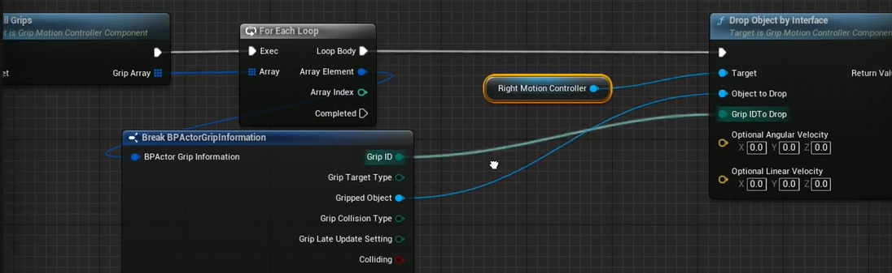
总览
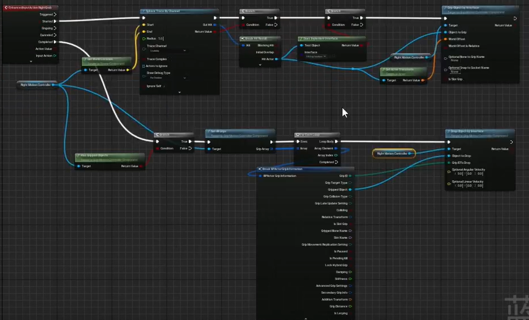

可以设定抓取的主要位置
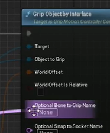
但要注意设定好三维参数
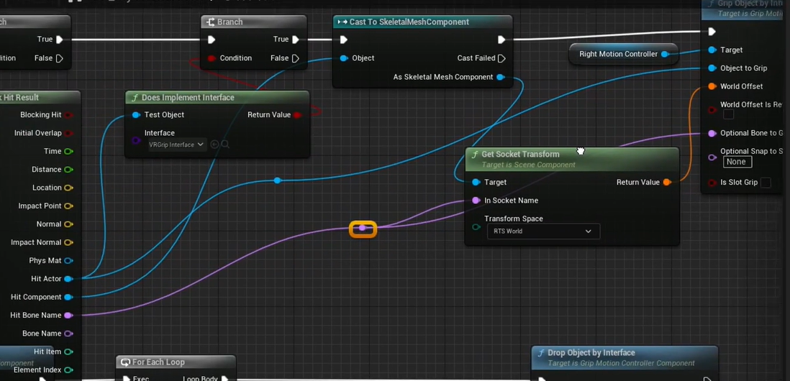

p4 抓取效果2
一些相应的同步与封装(不赘述)
选择抓取最优物体(设定优先级)
IsDensityGrips(设定拒绝抓取蓝图)
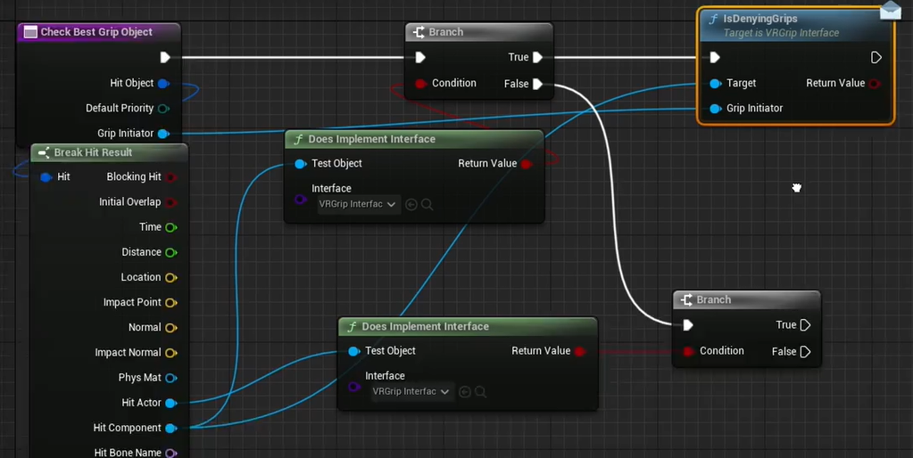
Advanced Grip Setting(抓取优先级)
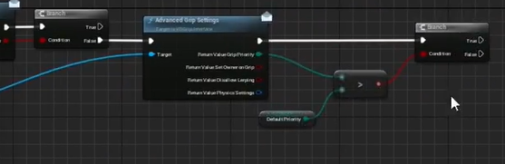
返回优先级以及最终判定抓握的物体对象
丢弃效果同理(同上若无效则传出空)
总览
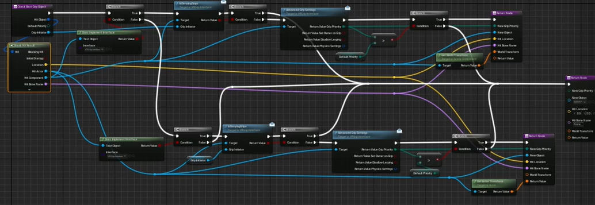

是否作为最优优先级(切传值,若非则传出不变变量)
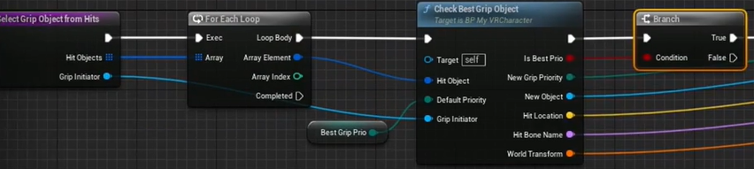
总览(右部分同为传出)
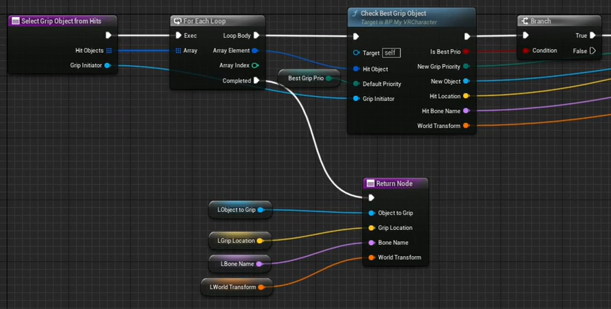

选择定义抓取到的物体
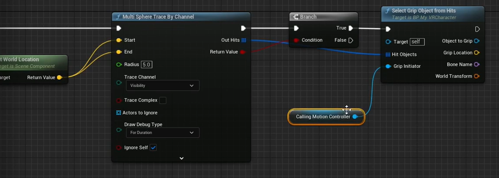
若非则传空
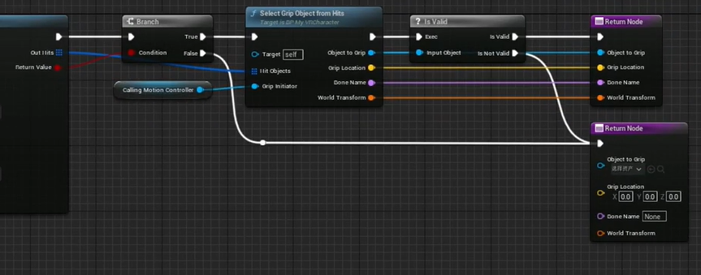

在没有任何物体抓取时则检测范围内的所有物体值得被抓取
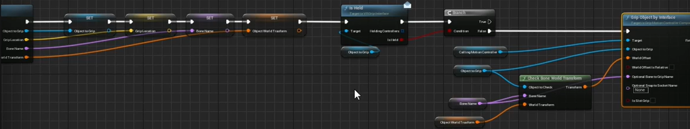

Allows Multiple Grips(是否允许多方抓取(多人联机))

暂且搁置
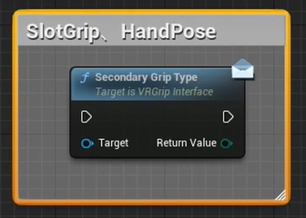

Drop的话 同理修改

p5 组件化抓取方案HandSocketComponent
被抓取物体添加该组件后可以设定手的抓取效果
蓝图类(HandSocketComponent)

2:45